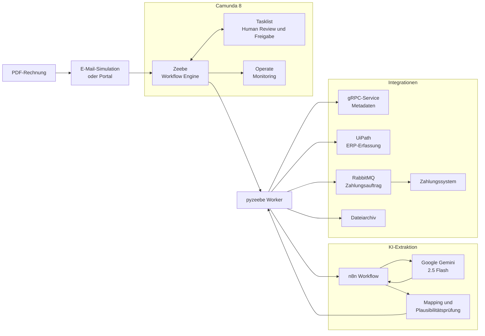
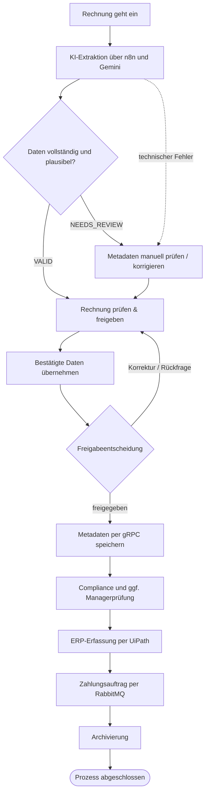
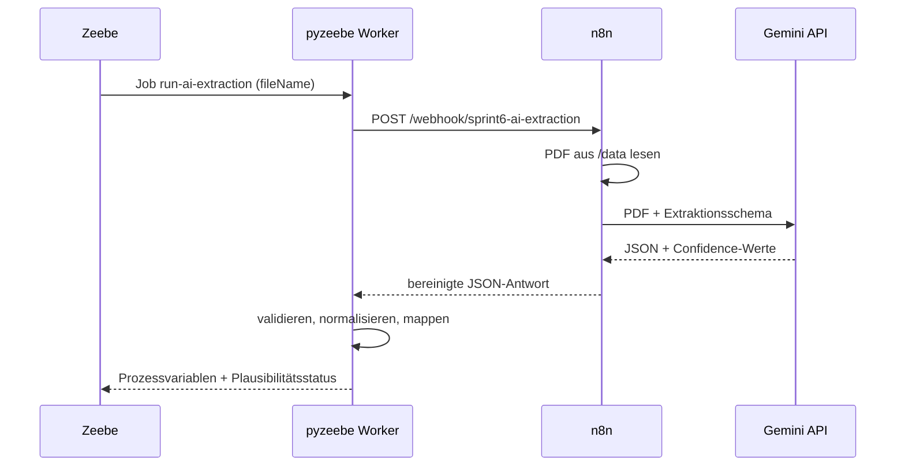

# DVG – Digitale Eingangsrechnungsbearbeitung

> Durchgängiger, KI-gestützter Rechnungsfreigabeprozess mit Camunda 8, n8n, Google Gemini, UiPath, gRPC und RabbitMQ.

**Stand:** 29. Juni 2026 · **Umfang:** Sprint 1–6 · **Status:** ausführbarer End-to-End-Prototyp

[Schnellstart](#schnellstart) · [Architektur](#systemarchitektur) · [Prozess](#fachlicher-prozess) · [Demo](#demo-szenarien) · [Dokumentation](#dokumentation)

---

## Projektüberblick

DVG digitalisiert die Bearbeitung eingehender PDF-Rechnungen vom Eingang bis zur Archivierung. Google Gemini extrahiert Rechnungsdaten, der Python-Worker prüft Pflichtfelder und Plausibilität, und Camunda 8 steuert den weiteren Ablauf. Unsichere Ergebnisse oder technische Ausfälle werden nicht blind weiterverarbeitet, sondern in klar definierte manuelle Aufgaben überführt.

Die Lösung verbindet die Ergebnisse aller sechs Sprints:

| Sprint | Schwerpunkt | Ergebnis im Gesamtsystem |
| ---: | --- | --- |
| 1 | Integration | gRPC-Metadatenspeicher, RabbitMQ und Zahlungssystem |
| 2 | Process Mining | Ist-Prozess, Varianten und Bottlenecks in Celonis |
| 3 | Zielarchitektur | Soll-Prozess und Camunda-basierte Orchestrierung |
| 4 | Workflow | Ausführbares BPMN, Formulare, DMN und Fehlerpfade |
| 5 | RPA | ERP-Erfassung über UiPath mit Simulationsmodus |
| 6 | KI-Workflow | PDF-Extraktion mit n8n/Gemini, Plausibilitätsprüfung und Human Review |

### Kernfunktionen

- KI-gestützte Extraktion strukturierter Rechnungsdaten aus PDF-Dateien
- Confidence- und Plausibilitätsprüfung mit einem Schwellwert von `0.85`
- Human-in-the-loop bei fehlenden, unsicheren oder widersprüchlichen Daten
- Prozesssteuerung und Monitoring über Camunda 8 / Zeebe
- Speicherung von Rechnungsmetadaten über gRPC
- regelbasierte Compliance-Prüfung über DMN
- ERP-Erfassung über UiPath oder den integrierten Simulationsmodus
- asynchrone Zahlungsaufträge über RabbitMQ
- Archivierung und modellierte manuelle Fallbacks

---

## Systemarchitektur



### Verantwortlichkeiten

| Komponente | Aufgabe |
| --- | --- |
| Camunda 8 / Zeebe | Orchestriert Prozess, Entscheidungen, Wiederholungen und Fehlerpfade |
| Tasklist / Operate | Stellt Benutzeraufgaben und Prozessmonitoring bereit |
| pyzeebe Worker | Führt technische Service Tasks aus und bindet die Systeme an |
| n8n | Liest die PDF und orchestriert den KI-Aufruf |
| Google Gemini 2.5 Flash | Extrahiert Rechnungsfelder und Confidence-Werte |
| gRPC-Service | Validiert und persistiert Rechnungsmetadaten |
| UiPath | Erfasst freigegebene Daten im ERP; ohne Credentials wird simuliert |
| RabbitMQ / Zahlungssystem | Übergibt und verarbeitet Zahlungsaufträge asynchron |
| `Rechnungsdaten/` | Enthält lokale PDFs, Logs und Abschlussartefakte zur Laufzeit |

---

## Fachlicher Prozess



Die KI trifft keine Freigabeentscheidung. Erst die im Human Review bestätigten Daten werden für gRPC, ERP, Zahlung und Archivierung verwendet.

### KI-Prüfregeln

Eine Extraktion erhält den Status `VALID`, wenn:

- alle Pflichtfelder vorhanden sind: `invoiceId`, `invoiceNumber`, `supplierName`, `invoiceDate`, `amountGross`, `currency`, `iban`, `billingAddress`;
- jedes Pflichtfeld einen Confidence-Wert von mindestens `0.85` besitzt;
- Netto- und Bruttobetrag numerisch und nicht negativ sind;
- `amountGross >= amountNet` gilt, sofern ein Nettobetrag vorliegt;
- die Währung aus drei Großbuchstaben besteht, beispielsweise `EUR`;
- die Rechnungs-ID – soweit aus dem Dateinamen ableitbar – zur Datei passt.

Andernfalls setzt der Worker `aiPlausibilityStatus = NEEDS_REVIEW` und dokumentiert die Ursachen in `aiReviewGruende`.

---

## Technischer Ablauf der KI-Extraktion



Der produktive n8n-Export liegt unter [`n8n/workflows/sprint6_ai_extraction.json`](n8n/workflows/sprint6_ai_extraction.json).

---

## Schnellstart

### Voraussetzungen

| Voraussetzung | Hinweis |
| --- | --- |
| Python | Version 3.9 oder neuer; ausführbar über `python`, `python3` oder `py` |
| Docker Desktop | Muss vor Installation und Start vollständig laufen |
| Git | Zum Klonen des Repositorys |
| Betriebssystem | Windows oder macOS; die Startskripte sind plattformspezifisch |
| Gemini API-Key | Für die reale KI-Extraktion erforderlich |

### 1. Repository klonen

```bash
git clone https://github.com/abab1016/DVG.git
cd DVG
```

### 2. Plattform festlegen

`plattform.txt` muss exakt `windows` oder `mac` enthalten.

**Windows (PowerShell):**

```powershell
Set-Content -Path plattform.txt -Value "windows" -NoNewline
```

**macOS:**

```bash
printf "mac" > plattform.txt
```

### 3. Umgebungsvariablen anlegen

Im Projektstamm neben `docker-compose.yml` eine Datei `.env` erstellen:

```dotenv
# Erforderlich für die KI-Extraktion
GEMINI_API_KEY=dein_gemini_api_key

# Optional: reale UiPath-Orchestrator-Integration
UIPATH_CLIENT_ID=deine_client_id
UIPATH_CLIENT_SECRET=dein_client_secret
UIPATH_ORG=deine_organisation
UIPATH_TENANT=dein_tenant
UIPATH_FOLDER_ID=deine_folder_id
UIPATH_QUEUE_NAME=DVG_Rechnungen
```

Ohne vollständige UiPath-Konfiguration verwendet der Worker automatisch den ERP-Simulationsmodus. Die `.env` ist über `.gitignore` ausgeschlossen und darf nicht committed werden.

### 4. Abhängigkeiten installieren

**Windows:**

```bat
scripts\install.bat
```

**macOS:**

```bash
chmod +x scripts/*.sh
./scripts/install.sh
```

Danach einmalig die gRPC-Stubs erzeugen:

**Windows:**

```powershell
python -m grpc_tools.protoc -I grpc-service/src/proto --python_out=grpc-service/src --grpc_python_out=grpc-service/src grpc-service/src/proto/invoice.proto
```

**macOS:**

```bash
python3 -m grpc_tools.protoc -I grpc-service/src/proto --python_out=grpc-service/src --grpc_python_out=grpc-service/src grpc-service/src/proto/invoice.proto
```

### 5. System starten

**Windows:**

```bat
scripts\start_all.bat
```

**macOS:**

```bash
./scripts/start_all.sh
```

Das Startskript:

1. startet RabbitMQ, Elasticsearch, Zeebe, Operate, Tasklist und n8n über Docker Compose;
2. wartet auf den Zeebe-Healthcheck;
3. deployt das aktuelle KI-BPMN, alle Formulare und die DMN-Regeln;
4. startet gRPC-Service, Worker und Zahlungs-Consumer in separaten Fenstern.

### 6. n8n-Workflow importieren

Dieser Schritt ist pro neuem n8n-Datenvolumen einmal erforderlich:

1. [n8n unter `localhost:5678`](http://localhost:5678) öffnen.
2. **Import from file** auswählen.
3. [`n8n/workflows/sprint6_ai_extraction.json`](n8n/workflows/sprint6_ai_extraction.json) importieren.
4. Den Workflow auf **Active** schalten.

Ohne aktiven Workflow kann der Worker den Webhook nicht aufrufen und Camunda verwendet den modellierten manuellen KI-Fallback.

### 7. Demo-Prozess starten

```powershell
# Windows
python scripts\auto_email_start.py
```

```bash
# macOS
python3 scripts/auto_email_start.py
```

Das Skript erzeugt eine neue Beispielrechnung unter `Rechnungsdaten/` und veröffentlicht die Startnachricht `Message_InvoiceReceived` an Zeebe.

---

## Benutzeroberflächen und Ports

| Dienst | Adresse | Zugang |
| --- | --- | --- |
| Camunda Tasklist | [localhost:8082](http://localhost:8082) | `demo` / `demo` |
| Camunda Operate | [localhost:8081](http://localhost:8081) | `demo` / `demo` |
| RabbitMQ Management | [localhost:15672](http://localhost:15672) | `admin` / `admin` |
| n8n | [localhost:5678](http://localhost:5678) | lokal |
| Elasticsearch | [localhost:9200](http://localhost:9200) | – |

| Port | Schnittstelle |
| ---: | --- |
| `26500` | Zeebe gRPC Gateway |
| `9600` | Zeebe Health / Monitoring |
| `50051` | Rechnungs-Metadatenservice über gRPC |
| `5672` | RabbitMQ AMQP |
| `8090` | Lieferanten-Simulator des Workers |

> Die vorkonfigurierten Zugänge sind ausschließlich für die lokale Demo geeignet.

---

## Demo-Szenarien

### 1. Happy Path

1. System und aktiven n8n-Workflow prüfen.
2. `scripts/auto_email_start.py` ausführen.
3. Extraktion in n8n kontrollieren.
4. Rechnung in Tasklist prüfen und freigeben.
5. Prozesslauf in Operate verfolgen.
6. ERP-Status, Zahlungslog und Archivierung prüfen.

### 2. Human Review

Eine unvollständige oder unsichere PDF führt zu `NEEDS_REVIEW`. In Tasklist werden die erkannten Gründe angezeigt; korrigierte Daten werden anschließend als finale Prozessvariablen übernommen.

### 3. Technischer Fallback

Die Ausfallskripte setzen lokale Laufzeitmarker. Der Worker erkennt diese ohne Neustart und löst nach der konfigurierten Anzahl von Versuchen den passenden BPMN-Fallback aus.

| Komponente | Windows | macOS | Versuche | Manueller Fallback |
| --- | --- | --- | ---: | --- |
| KI / n8n | `scripts\ai_failure.bat` | `./scripts/ai_failure.sh` | 1 | Metadaten erfassen |
| gRPC | `scripts\grpc_failure.bat` | `./scripts/grpc_failure.sh` | 3 | Metadaten speichern |
| UiPath / ERP | `scripts\erp_failure.bat` | `./scripts/erp_failure.sh` | 1 | ERP-Erfassung |
| RabbitMQ | `scripts\rabbitmq_failure.bat` | `./scripts/rabbitmq_failure.sh` | 3 | Zahlung erfassen |
| Archivierung | `scripts\archive_failure.bat` | `./scripts/archive_failure.sh` | 3 | Rechnung archivieren |

Beispiel:

```powershell
scripts\rabbitmq_failure.bat fail
scripts\rabbitmq_failure.bat status
scripts\rabbitmq_failure.bat restore
```

```bash
./scripts/rabbitmq_failure.sh fail
./scripts/rabbitmq_failure.sh status
./scripts/rabbitmq_failure.sh restore
```

Ein gesetzter Fehler bleibt bis `restore` aktiv. Vor dem nächsten Demo-Lauf deshalb den Status prüfen.

---

## Tests

Die Unit-Tests mocken externe Dienste; das Gesamtsystem muss dafür nicht laufen:

```bash
python -m pytest worker/src/tests/ grpc-service/tests/ client/src/tests/ zahlungssystem/src/tests/ -v
```

Abgedeckt sind unter anderem:

- Mapping, Normalisierung und Plausibilitätsprüfung der KI-Antwort
- Human-Review-Merge
- gRPC-, RabbitMQ-, Archivierungs- und UiPath-Handler
- Fehler-Injektion und BPMN-relevante Business Errors
- gRPC-Service, Client und Zahlungs-Consumer

---

## Projektstruktur

```text
DVG/
├── BPMN/
│   ├── G7_Rechnungsfreigabe_with_AI.bpmn  # aktueller ausführbarer Prozess
│   └── Forms/                             # Camunda Forms und Compliance-DMN
├── worker/src/
│   ├── worker.py                          # Worker, Router und Lieferanten-Simulator
│   ├── handlers/                          # Service-Task-Handler
│   └── mapping/                           # Datenverträge und Transformationen
├── grpc-service/                          # Metadatenservice und Proto-Vertrag
├── zahlungssystem/                        # RabbitMQ-Consumer
├── client/                                # eigenständiger Sprint-1-Client
├── n8n/workflows/                         # exportierter Gemini-Workflow
├── scripts/                               # Installation, Start, Stop, Demo, Fallbacks
├── docs/                                  # Sprint- und Schnittstellendokumentation
├── images/                                # Prozess- und Celonis-Abbildungen
├── Rechnungsdaten/                        # lokale Laufzeitdaten, nicht versioniert
├── docker-compose.yml                     # lokale Infrastruktur
├── plattform.txt                          # windows oder mac
└── .env                                   # lokale Secrets, nicht versioniert
```

---

## Dokumentation

| Thema | Dokument |
| --- | --- |
| Finale Sprint-6-Gesamtdokumentation | [`docs/sprint6_dokumentation.md`](docs/sprint6_dokumentation.md) |
| KI-Workflow und technische Umsetzung | [`docs/sprint6_ai-agent.md`](docs/sprint6_ai-agent.md) |
| KI-Datenvertrag | [`docs/datenvertrag_ai_extraction.md`](docs/datenvertrag_ai_extraction.md) |
| Human-Review-Datenvertrag | [`docs/datenvertrag_human_review.md`](docs/datenvertrag_human_review.md) |
| Fehlerfälle und Systemgrenzen | [`docs/fehlerfaelle_und_grenzen.md`](docs/fehlerfaelle_und_grenzen.md) |
| UiPath-Integration | [`docs/sprint5_dokumentation.md`](docs/sprint5_dokumentation.md) |
| Camunda-Workflow | [`docs/sprint4_workflow-implementierung.md`](docs/sprint4_workflow-implementierung.md) |
| Soll-Prozess und Zielarchitektur | [`docs/sprint3_Soll-Prozess_und_Zielarchitektur.md`](docs/sprint3_Soll-Prozess_und_Zielarchitektur.md) |
| Process Mining | [`docs/sprint2_process-mining.md`](docs/sprint2_process-mining.md) |
| Integrationsarchitektur | [`docs/sprint1_Integrationsarchitektur.md`](docs/sprint1_Integrationsarchitektur.md) |

---

## System stoppen

**Windows:**

```bat
scripts\stop_all.bat
```

**macOS:**

```bash
./scripts/stop_all.sh
```

Persistente Docker-Volumes für Elasticsearch, Zeebe und n8n bleiben dabei erhalten.

---

## Häufige Probleme

<details>
<summary><strong>Zeebe wird nicht bereit</strong></summary>

```bash
docker compose logs zeebe
docker compose logs elasticsearch
```

Zeebe startet erst, wenn Elasticsearch healthy ist.
</details>

<details>
<summary><strong>ModuleNotFoundError: invoice_pb2</strong></summary>

Die gRPC-Stubs wurden noch nicht erzeugt. Den `grpc_tools.protoc`-Befehl aus Schritt 4 erneut ausführen.
</details>

<details>
<summary><strong>KI-Extraktion endet im manuellen Fallback</strong></summary>

Prüfen, ob der n8n-Workflow importiert und aktiv ist, `GEMINI_API_KEY` im n8n-Container verfügbar ist und kein KI-Ausfallmarker gesetzt wurde:

```powershell
scripts\ai_failure.bat status
```
</details>

<details>
<summary><strong>Gemini antwortet mit HTTP 429</strong></summary>

Das API-Kontingent wurde erreicht. Nach Ablauf des Rate-Limit-Fensters erneut versuchen oder das verwendete Google-AI-Kontingent prüfen.
</details>

<details>
<summary><strong>UiPath wird nur simuliert</strong></summary>

Der Worker wechselt nur bei vollständigen UiPath-Variablen in den realen Orchestrator-Modus. Fehlt ein Wert, wird absichtlich der integrierte Simulationspfad ausgeführt.
</details>

---

## Grenzen und Sicherheit

- Der Prototyp ist keine produktive Buchhaltungs-, OCR- oder Dokumentenmanagement-Lösung.
- LLM-Ausgaben können trotz Confidence-Werten falsch sein; die finale Freigabe bleibt menschlich.
- Demo-Zugangsdaten und unverschlüsselte lokale Schnittstellen sind nicht für Produktion ausgelegt.
- API-Schlüssel und UiPath-Secrets gehören ausschließlich in die lokale `.env`.
- Die reale UiPath-Integration hängt von Orchestrator, Queue-Konfiguration und einer stabilen ERP-Oberfläche ab.
- Externe API-Verfügbarkeit und Kontingente können die Demo beeinflussen; der Geschäftsprozess bleibt über manuelle Fallbacks bearbeitbar.
