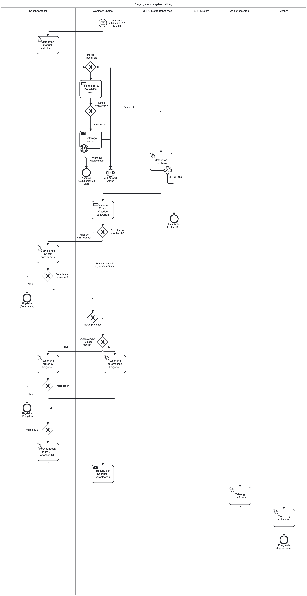
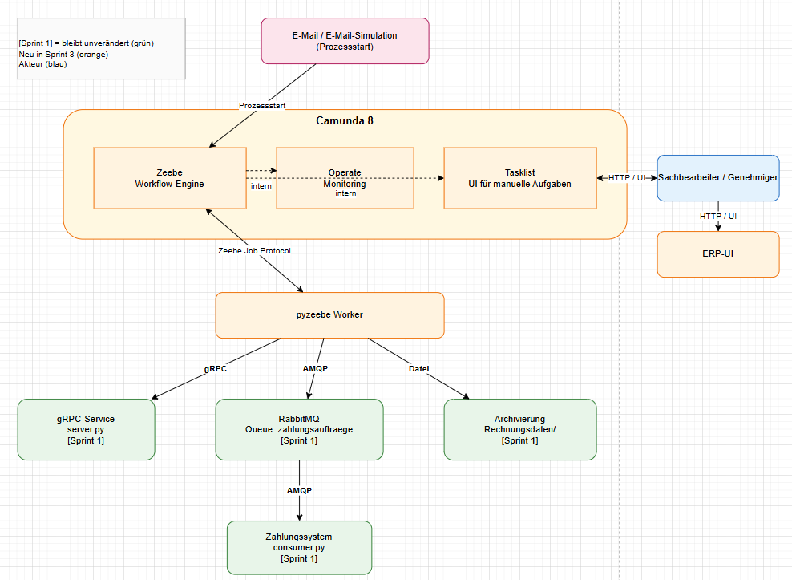

# Sprint 3 — Soll-Prozess und Zielarchitektur

**Projekt:** DVG — Digitalisierung Eingangsrechnungsbearbeitung  
**Sprint-Zeitraum:** Mai 2026  
**Team:** Sam Haghighi, Efe Yueksei, Nick Rusna, Abubakar Abdi Tube  
**GitHub:** [https://github.com/abab1016/DVG]

---

## 1. Ziel des Sprints

Ziel von Sprint 3 ist es, die Ergebnisse aus Sprint 2 in einen konkreten Soll-Prozess und eine technische Zielarchitektur zu überführen. Die Implementierung des Workflows erfolgt erst in Sprint 4.

- Optimierungspotenziale aus der Process-Mining-Analyse ableiten.
- Soll-Prozess der Eingangsrechnungsbearbeitung in BPMN modellieren.
- Camunda 8 als Workflow-Engine für Sprint 4 festlegen.
- Zielarchitektur inklusive Camunda, pyzeebe-Worker, gRPC-Service, RabbitMQ, Zahlungssystem, ERP-UI und Archivierung beschreiben.
- Review-Demo und Übergabe an Sprint 4 vorbereiten.

---

## 2. Ausgangslage

Sprint 3 baut direkt auf den Ergebnissen aus Sprint 1 und Sprint 2 auf. Aus Sprint 1 bleiben die technischen Integrationsbausteine erhalten. Aus Sprint 2 werden die Ist-Prozessanalyse, Varianten und Bottlenecks als Grundlage für Optimierungen genutzt.

### 2.1 Übernahme aus Sprint 1

| Komponente | Status | Rolle im Sprint-3-Zielbild |
|---|---|---|
| `gRPC-Service` | vorhanden | Speichert Rechnungsmetadaten und gibt eine bestätigte invoiceId zurück. |
| `RabbitMQ` | vorhanden | Queue zahlungsauftraege für asynchrone Zahlungsaufträge. |
| `Zahlungssystem` | vorhanden | Consumer verarbeitet Zahlungsaufträge und schreibt ein Zahlungsprotokoll. |
| `Client/UI` | vorhanden | Wird im Zielbild durch Camunda Tasklist und ERP-UI ersetzt bzw. ergänzt. |
| `Rechnungsdaten/` | vorhanden | JSON-Dateien und Zahlungslog als einfache Archivierung. |

### 2.2 Erkenntnisse aus Sprint 2

| Erkenntnis | Wert/Bewertung | Konsequenz für Sprint 3 |
|---|---|---|
| `Enter into ERP → Execute Payment` | ca. 2 Tage | Größter Bottleneck; Zahlungsauftrag soll nach ERP-Erfassung automatisiert ausgelöst werden. |
| `Validate Invoice → Approve Invoice` | ca. 7 Stunden | Freigabeengpass; Business Rules und optionale User Tasks vorsehen. |
| `Request Info / Receive Info` | Schleife/Rework | Rückfragen als explizite Iteration mit Timer/Eskalation modellieren. |
| `Compliance Check` | Sonderfall | Nur regelbasiert bei auffälligen Rechnungen ausführen, nicht im Standardfall. |
| `Nicht abgeschlossene Fälle` | ca. 80 Fälle | Klare Endzustände, Fristen und Monitoring über Camunda Operate. |

---

## 3. Optimierungspotenziale

| Priorität | Optimierung | Umsetzung im Soll-Prozess |
|---:|---|---|
| 1 | Zahlung beschleunigen | Service Task sendet Zahlungsauftrag über RabbitMQ direkt nach ERP-Erfassung. |
| 2 | Freigabe regelbasiert steuern | Business Rules entscheiden automatische Freigabe oder manuelle Freigabe. |
| 3 | Rückfragen reduzieren | Pflichtfeld- und Plausibilitätsprüfung früh im Prozess. |
| 4 | Compliance risikobasiert steuern | Compliance Check nur bei Schwellenwerten/Auffälligkeiten. |
| 5 | Offene Fälle überwachen | Timer, Eskalationen und Operate-Monitoring. |

---

## 4. Architekturentscheidungen

Die Architektur folgt dem Muster aus Sprint 1: klare technische Entscheidungen mit kurzer Begründung. Bestehende Komponenten werden nicht ersetzt, sondern über Camunda orchestriert.

| Entscheidung | Festlegung | Begründung |
|---|---|---|
| Workflow-Engine | Camunda 8 / Zeebe | BPMN-Ausführung, Prozesszustand, Service Tasks, User Tasks. |
| Manuelle Aufgaben | Camunda Tasklist | Ersetzt das einfache Sprint-1-Menü für Workflow-Aufgaben. |
| Monitoring | Camunda Operate | Live-Ansicht für laufende, beendete und fehlerhafte Instanzen. |
| Service-Anbindung | pyzeebe-Worker | Python-Adapter zwischen Camunda und Sprint-1-Komponenten. |
| Metadaten | gRPC-Service bleibt | Bestehende Implementierung wird weiterverwendet. |
| Zahlung | RabbitMQ + Consumer bleiben | Bestehende Messaging-Strecke wird weiterverwendet. |
| ERP | ERP-UI als Mock | Manuelle ERP-Erfassung wird für Sprint 4 vorbereitet. |

---

## 5. Soll-Prozess in BPMN

Der Soll-Prozess führt eine zentrale Workflow-Steuerung ein. Camunda übernimmt Prozesszustand, Aufgabenverteilung, Business Rules, optionale Prüfungen, Schleifen und Eskalationen.

- Kein eigener Lieferantenpool: Rechnungseingang wird als Startereignis modelliert.
- Unterschiedliche Eingänge wie E-Mail, E-Mail-Simulation, Upload oder manuelle Erfassung führen in denselben Prozess.
- Compliance Check ist wichtig, aber nur als optionaler Pfad bei Auffälligkeit.
- Rückfragen und Korrekturen sind als Iterationen/Schleifen modelliert.
- Business Rules steuern Pflichtfeldprüfung, Compliance-Entscheidung und Freigabeart.

| BPMN-Element | Verwendung im Soll-Prozess |
|---|---|
| Start Event | Rechnungseingang über E-Mail/E-Mail-Simulation; kein eigener Lieferantenpool. |
| User Task | Metadaten erfassen, Rückfrage bearbeiten, Compliance Check, manuelle Freigabe, ERP-Eingabe bestätigen. |
| Service Task | Metadaten speichern, Zahlungsauftrag senden, Archivierung anstoßen. |
| Exclusive Gateway | Daten vollständig?, Compliance erforderlich?, automatische Freigabe möglich? |
| Timer Event | Warten auf Antwort, Eskalation bei Fristüberschreitung. |
| Error Boundary Event | Technische Fehler bei gRPC, Zahlung oder Archivierung abfangen. |
| End Events | Erfolgreich abgeschlossen, abgelehnt, technischer Fehler, Zeitüberschreitung. |

### 5.1 BPMN-Gesamtübersicht



---

## 6. Zielarchitektur

Die Zielarchitektur integriert Camunda in die vorhandene Sprint-1-Landschaft. Camunda steuert den End-to-End-Prozess; pyzeebe-Worker verbinden die Engine mit gRPC, RabbitMQ und Archivierung.



| Verbindung | Kommunikation | Bedeutung |
|---|---|---|
| E-Mail/E-Mail-Simulation → Zeebe | Starttrigger / HTTP | Start einer Prozessinstanz. |
| Zeebe → Tasklist | Camunda-intern | Anlegen manueller Aufgaben. |
| Tasklist ↔ Benutzer | HTTP/UI | Bearbeitung der User Tasks im Browser. |
| Benutzer → ERP-UI | HTTP/UI | Manuelle ERP-Erfassung. |
| Zeebe ↔ pyzeebe-Worker | Zeebe Job Protocol | Worker holt Service Tasks und meldet Ergebnisse zurück. |
| Worker → gRPC-Service | gRPC | Metadaten speichern. |
| Worker → RabbitMQ | AMQP | Zahlungsauftrag senden. |
| RabbitMQ → Zahlungssystem | AMQP | Asynchrone Zahlungsbearbeitung. |
| Worker → Archivierung | Datei/JSON | Rechnung bzw. Abschlussprotokoll ablegen. |

---

## 7. Vorbereitung für Sprint 4

Sprint 4 implementiert den digitalen Freigabeprozess als Workflow. Aus Sprint 3 ergeben sich diese konkreten Arbeitspakete:

1. Camunda 8 lokal per Docker/docker-compose starten.
2. BPMN-Modell deployen und erste Prozessinstanz starten.
3. Prozessstart zunächst per E-Mail-Simulation, Upload oder manuellem Start umsetzen.
4. Tasklist-Formulare für Metadaten, Rückfrage, Freigabe und ERP-Bestätigung definieren.
5. pyzeebe-Worker für gRPC-Speicherung, RabbitMQ-Zahlungsauftrag und Archivierung implementieren.
6. Bestehenden gRPC-Service und bestehenden RabbitMQ-Consumer aus Sprint 1 weiterverwenden.
7. ERP-UI als einfacher Mock bereitstellen.
8. Fehlerpfade testen: fehlende Daten, gRPC nicht erreichbar, Payment-Fehler, Ablehnung.
9. Review-Demo aufbauen: Prozessstart, Tasklist, Worker-Aufrufe, Operate-Monitoring.

---

### Kurzsprechtext

Aus Sprint 2 haben wir gesehen, dass der Ist-Prozess grundsätzlich funktioniert, aber klare Engpässe besitzt. Der größte Engpass liegt zwischen ERP-Erfassung und Zahlung, danach folgen Freigabezeiten, Rückfragen und Sonderfälle. Sprint 3 überführt diese Erkenntnisse in einen Soll-Prozess mit Camunda-Steuerung. Camunda übernimmt User Tasks, Service Tasks, Business Rules, optionale Compliance Checks, Iterationen und Monitoring. Die Sprint-1-Komponenten bleiben erhalten: gRPC speichert Metadaten, RabbitMQ übergibt Zahlungsaufträge, das Zahlungssystem verarbeitet sie, und die Archivierung nutzt JSON-Dateien. Sprint 4 setzt diesen Zielprozess technisch um.

---

## 8. Bekannte Einschränkungen und offene Punkte

| Punkt | Einordnung |
|---|---|
| E-Mail-Start | Für Sprint 4 reicht zuerst eine Simulation; echte Mail-Anbindung nur falls zeitlich machbar. |
| ERP-System | Einfacher Mock reicht, weil im Sprint-4-Szenario manuelle ERP-Eingabe gefordert ist. |
| Business Rules | Zunächst als Gateway/Expressions im BPMN; DMN kann später ergänzt werden. |
| Compliance Check | Optionaler Pfad bei Auffälligkeit, nicht bei jeder Rechnung. |
| Schnittstellen/Datenobjekte | Nicht Teil von Sprint 3; detaillierte Ausarbeitung wird in Sprint 4 nachgezogen. |

---

## 9. Definition of Done

| Kriterium | Status | Nachweis |
|---|---|---|
| Sprint-3-Dokumentation vollständig | erfüllt | Kapitel 1–9 |
| Optimierungen aus Sprint 2 eingebunden | erfüllt | Kapitel 3 |
| BPMN-Sollprozess mit Bildern eingebunden | erfüllt | Kapitel 5 |
| Camunda-Entscheidung dokumentiert | erfüllt | Kapitel 4 |
| Zielarchitektur mit Bild eingebunden | erfüllt | Kapitel 6 |
| Sprint-4-Übergabe vorbereitet | erfüllt | Kapitel 7 |
| Offene Punkte transparent | erfüllt | Kapitel 9 |

---

## 10. Jira-Abschlusskommentar

```text
Vorgang 6 abgeschlossen.

Die Sprint-3-Dokumentation wurde an den Aufbau der Sprint-1- und Sprint-2-Dokumentation angepasst. Enthalten sind:
- Ziel des Sprints
- Ausgangslage aus Sprint 1 und Sprint 2
- Optimierungspotenziale
- Architekturentscheidungen
- BPMN-Sollprozess mit eingebundenen Bildern
- Zielarchitektur mit eingebundenem Architekturdiagramm
- Vorbereitung für Sprint 4
- Review-Demo-Skript
- bekannte Einschränkungen und DoD-Prüfung

Vorgang 5 bleibt wie im Statusmeeting besprochen außerhalb von Sprint 3 und wird in Sprint 4 detailliert.
```
