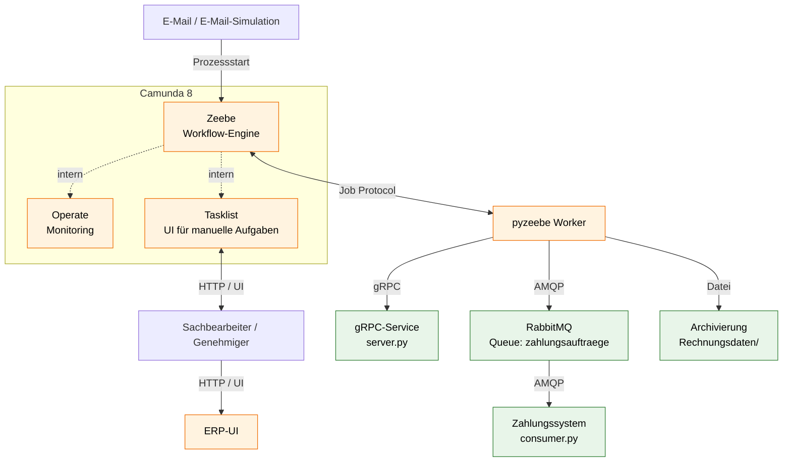
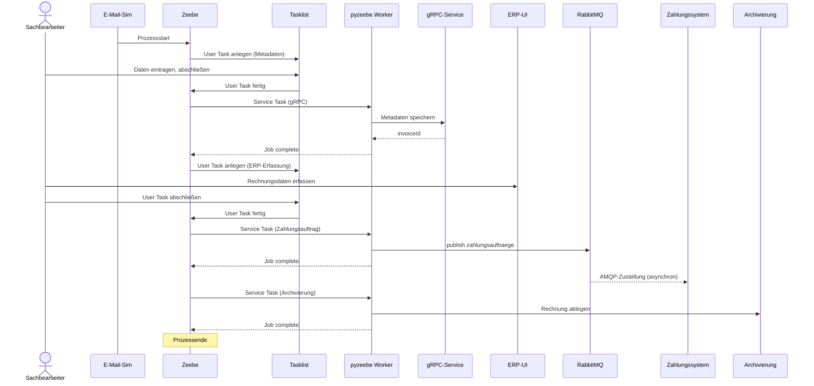

# Sprint 3 — Zielarchitektur inkl. Workflow-Engine

**Projekt:** DVG — Digitalisierung Eingangsrechnungsbearbeitung
**Sprint-Zeitraum:** Mai 2026
**Team:** Sam Haghighi, Efe Yueksei, Nick Rusnak, Abubakar Abdi Tube
**GitHub:** [https://github.com/abab1016/DVG]

## 1. Ziel der Aufgabe

Die Aufgabe entwirft die Zielarchitektur für den digitalen Freigabeprozess. Sie zeigt, wie die vorhandenen Komponenten aus Sprint 1 mit der neuen Workflow-Engine zusammenarbeiten, welche Komponenten neu hinzukommen und über welche Schnittstellen sie kommunizieren.

Die Architektur soll zum Soll-Prozess passen, der parallel als BPMN modelliert wird (KAN-157), und die in KAN-167 getroffene Werkzeugentscheidung umsetzen. Die Implementierung selbst ist nicht Bestandteil dieser Aufgabe.

---

## 2. Architekturentscheidung 

| Punkt                     | Festlegung                                                                                                          |
| ------------------------- | ------------------------------------------------------------------------------------------------------------------- |
| Workflow-Engine           | Camunda 8 (Zeebe). Auswahl und Begründung in KAN-167.                                                              |
| Anbindung an die Engine   | pyzeebe-Worker als Python-Adapter. Begründung in KAN-166.                                                          |
| UI für manuelle Aufgaben | Camunda Tasklist. Ersetzt das Menü aus`client/src/ui.py`.                                                          |
| Sprint-1-Komponenten      | gRPC-Service, RabbitMQ und Zahlungssystem bleiben unverändert und werden von der Engine über Worker angesprochen. |
| ERP-System                | Eigene UI neben der Tasklist. Bisher nicht implementiert.                                                           |
| Archivierung              | Bestehender Ordner`Rechnungsdaten/` mit JSON-Dateien.                                                               |

---

## 3. Komponenten der Zielarchitektur

| Komponente                    | Herkunft                      | Aufgabe                                                |
| ----------------------------- | ----------------------------- | ------------------------------------------------------ |
| E-Mail / E-Mail-Simulation    | neu                           | Prozessstart                                           |
| Camunda 8 — Zeebe            | neu                           | Workflow-Engine, zentrale Prozesssteuerung             |
| Camunda 8 — Operate          | neu                           | Monitoring laufender Prozessinstanzen, Demo-Ansicht    |
| Camunda 8 — Tasklist         | neu                           | UI für manuelle Aufgaben (Client/UI)                  |
| pyzeebe-Worker                | neu                           | Python-Worker zwischen Engine und Sprint-1-Komponenten |
| ERP-UI                        | neu, noch nicht implementiert | Manuelle Eingabe der Rechnungsdaten ins ERP            |
| gRPC-Service`server.py`       | aus Sprint 1                  | Speicherung der Rechnungsmetadaten                     |
| RabbitMQ-Broker               | aus Sprint 1                  | Queue`zahlungsauftraege` für Zahlungsaufträge        |
| Zahlungssystem`consumer.py`   | aus Sprint 1                  | Empfänger der Payment Messages                        |
| Archivierung`Rechnungsdaten/` | aus Sprint 1                  | Prozessabschluss, JSON-Dateien                         |

---

## 4. Diagramme

### 4.1 Architekturdiagramm (KAN-175)

Eine bearbeitbare Version liegt unter `docs/sprint3_zielarchitektur.drawio`. Der PNG-Export landet in `images/sprint3_zielarchitektur.png` (KAN-178).

### 4.2 Sequenzdiagramm 

Ablauf einer Rechnung im Happy Path:

Sonderfälle wie Rückfragen, manuelle Freigabe und Compliance Check sind im Happy Path nicht enthalten. Sie werden im BPMN-Modell modelliert (KAN-157).

#### Erklärung in vier Phasen

**Phase 1 — Prozessstart**

1. Eine eingehende Rechnung (E-Mail-Simulation) löst über ein Message Start Event eine neue Prozessinstanz in Zeebe aus.

**Phase 2 — Metadaten erfassen und speichern**

2. Zeebe legt einen User Task in der Tasklist an ("Metadaten kontrollieren").
3. Der Sachbearbeiter öffnet die Aufgabe in der Tasklist, trägt die Metadaten ein und schließt den Task ab.
4. Die Tasklist meldet den abgeschlossenen User Task zurück an Zeebe.
5. Zeebe stellt einen Service-Task-Job bereit. Ein pyzeebe-Worker holt ihn ab.
6. Der Worker ruft per gRPC den Service `server.py` aus Sprint 1 auf und übergibt die Metadaten.
7. Der gRPC-Service speichert die Daten als JSON und antwortet mit der invoiceId.
8. Der Worker meldet den Job an Zeebe als abgeschlossen, die invoiceId wird Prozessvariable.

**Phase 3 — ERP-Erfassung und Zahlungsauftrag**

9. Zeebe legt den nächsten User Task in der Tasklist an ("Rechnung im ERP erfassen").
10. Der Sachbearbeiter trägt die Rechnungsdaten in der separaten ERP-UI ein.
11. Anschließend bestätigt er den User Task in der Tasklist.
12. Die Tasklist meldet zurück an Zeebe.
13. Zeebe stellt den nächsten Service-Task-Job bereit, der Worker holt ihn ab.
14. Der Worker publiziert einen Zahlungsauftrag in die RabbitMQ-Queue `zahlungsauftraege`.
15. Der Worker meldet den Job als abgeschlossen.
16. Die Zustellung an das Zahlungssystem (`consumer.py`) läuft asynchron. Zeebe wartet nicht darauf.

**Phase 4 — Archivierung und Prozessende**

17. Zeebe stellt den letzten Service-Task-Job bereit (Archivierung), der Worker holt ihn ab.
18. Der Worker legt die fertige Rechnung als JSON in `Rechnungsdaten/` ab.
19. Der Worker meldet den Job als abgeschlossen.
20. Die Prozessinstanz endet. In Operate ist sie ab jetzt unter abgeschlossenen Prozessen sichtbar.

#### Hinweise zur Darstellung

- Das Mermaid-Diagramm rendert in GitHub und in Obsidian (Mermaid-Plugin). In einem reinen Texteditor wird nur der Code angezeigt.
- Für einen Screenshot zum Sichern (KAN-178): die gerenderte Version im Browser öffnen und ein Bild speichern, dann nach `images/sprint3_sequenzdiagramm.png` kopieren.

---

## 5. Kommunikationsarten 

| Verbindung                  | Art                 | Anmerkung                                   |
| --------------------------- | ------------------- | ------------------------------------------- |
| E-Mail-Simulation → Zeebe  | HTTP (REST)         | Auslöser des Message Start Event           |
| Zeebe ↔ Operate / Tasklist | intern (Camunda)    | Teil des Camunda-Setups                     |
| Zeebe ↔ pyzeebe-Worker     | Zeebe Job Protocol  | Worker abonniert Job-Typen, holt Jobs aktiv |
| Tasklist ↔ Sachbearbeiter  | HTTP (UI)           | Browser                                     |
| Sachbearbeiter ↔ ERP-UI    | HTTP (UI)           | Browser, separates System                   |
| Worker → gRPC-Service      | gRPC                | synchron, wie in Sprint 1                   |
| Worker → RabbitMQ          | AMQP                | asynchron, wie in Sprint 1                  |
| RabbitMQ → Zahlungssystem  | AMQP                | unverändert aus Sprint 1                   |
| Worker → Archivierung      | Dateischreibvorgang | JSON in`Rechnungsdaten/`                    |
