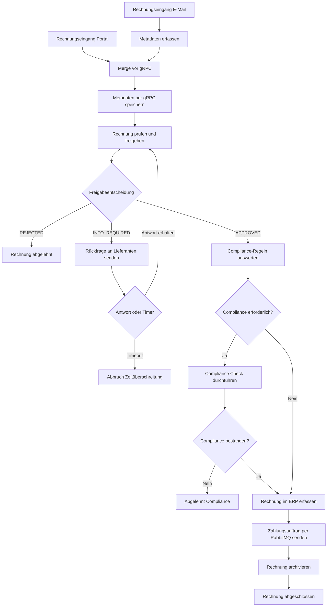

# Sprint 4 — Workflow Implementierung mit Camunda

**Projekt:** DVG — Digitalisierung der Eingangsrechnungsbearbeitung  
**Sprint-Zeitraum:** 12.05.2026–02.06.2026  
**Team:** Sam Haghighi, Efe Yueksel, Nick Rusnak, Abubakar Abdi Tube  
**GitHub:** https://github.com/abab1016/DVG  
**Sprint-Artefakte:** `G7_Rechnungsfreigabe.bpmn`, `compliance-regeln.dmn`, Camunda Forms, Test-Szenarien  
**Dokumentationsstand:** Sprint 4 Abschlussdokumentation

---

## 1. Ziel des Sprints

Ziel von Sprint 4 war die Implementierung eines digitalen Freigabeprozesses als ausführbarer Workflow mit Camunda.

Der Prozess zur Eingangsrechnungsbearbeitung sollte nicht mehr nur fachlich modelliert werden, sondern als lauffähiger Workflow umgesetzt werden. Dabei werden die technischen Ergebnisse aus Sprint 1 wiederverwendet und durch eine Process Engine orchestriert.

Sprint 4 setzt damit die Zielarchitektur aus Sprint 3 praktisch um:

- Camunda steuert den Ablauf des Rechnungsfreigabeprozesses.
- Manuelle Tätigkeiten werden über Camunda User Tasks und Forms eingebunden.
- Automatisierte Schritte werden über Service Tasks vorbereitet.
- Business Rules werden über DMN modelliert.
- Fehlerfälle werden über Boundary Events und manuelle Fallbacks behandelt.
- Die vorhandenen Sprint-1-Komponenten gRPC-Service, RabbitMQ und Zahlungssystem bleiben Teil der Architektur.

Der Schwerpunkt liegt auf einer nachvollziehbaren Workflow-Orchestrierung, nicht auf vollständiger Produktivautomatisierung. RPA und AI Agent bleiben bewusst für Sprint 5 und Sprint 6 vorgesehen.

---

## 2. Ausgangslage

### 2.1 Ausgangsszenario

Das Projekt betrachtet die digitale Verarbeitung von Eingangsrechnungen in einem mittelständischen Unternehmen. Der ursprüngliche Prozess ist teilweise manuell und enthält Medienbrüche.

Der typische fachliche Ablauf ist:

1. Lieferant sendet Rechnung.
2. Sachbearbeiter speichert Rechnung und Metadaten.
3. Rechnungsdaten werden extrahiert.
4. Rechnung wird geprüft.
5. Rechnung wird im ERP-System erfasst.
6. Zahlung wird veranlasst.
7. Rechnung wird archiviert.

Sprint 4 konzentriert sich auf die technische Umsetzung dieses Freigabeprozesses als Workflow.

### 2.2 Übernahme aus Sprint 1

Aus Sprint 1 wurden die vorhandenen technischen Integrationsbausteine übernommen:

| Komponente | Rolle in Sprint 4 |
|---|---|
| `gRPC-Service` | Speicherung der Rechnungsmetadaten |
| `RabbitMQ` | Message Broker für Zahlungsaufträge |
| `Zahlungssystem` | Consumer, der Zahlungsaufträge verarbeitet |
| `Rechnungsdaten/` | einfache Dateiablage für Rechnungen und Zahlungslog |
| `Client-Logik` | fachliche Vorlage für Metadatenspeicherung und Zahlungsauslösung |

Die Architekturentscheidung aus Sprint 4 lautet: Die Sprint-1-Komponenten werden nicht ersetzt, sondern durch Camunda gesteuert.

### 2.3 Übernahme aus Sprint 2

Aus der Process-Mining-Analyse wurden folgende Erkenntnisse übernommen:

| Erkenntnis | Konsequenz im Sprint-4-Workflow |
|---|---|
| Freigabe ist ein relevanter manueller Schritt | User Task `Rechnung prüfen & freigeben` |
| Rückfragen erzeugen Iterationen | Rückfragepfad mit Warten auf Antwort |
| Compliance Checks treten nicht immer auf | optionale DMN-/Compliance-Prüfung |
| ERP-Erfassung bleibt zunächst manuell | User Task `Rechnung im ERP erfassen` |
| Zahlung soll nach Freigabe/ERP möglichst direkt erfolgen | Service Task `Zahlungsauftrag per RabbitMQ senden` |
| Fehlerfälle müssen sichtbar werden | Boundary Events und manuelle Fallbacks |

### 2.4 Übernahme aus Sprint 3

Sprint 3 definierte den Soll-Prozess und die Zielarchitektur. Für Sprint 4 wurde daraus konkret:

- Camunda als Workflow Engine,
- BPMN als ausführbares Prozessmodell,
- User Tasks für menschliche Tätigkeiten,
- Service Tasks für technische Integrationen,
- DMN für regelbasierte Compliance-Entscheidungen,
- RabbitMQ und gRPC als vorhandene Integrationspunkte,
- ERP-UI als manuell bedientes System.

---

## 3. Anforderungen aus der Sprint-4-Aufgabe

Die Sprint-4-Aufgabe fordert die Implementierung eines digitalen Freigabeprozesses als Workflow.

| Anforderung | Umsetzung in unserem Sprint-4-Ergebnis |
|---|---|
| Start des Prozesses per E-Mail | BPMN Start Event `Rechnungseingang (E-Mail)` |
| manuelle Extraktion der Metadaten | Camunda Form `Metadaten_Erfassung.form` |
| Speicherung der Metadaten per gRPC-Service | Service Task `Metadaten per gRPC speichern` |
| ERP-Eingabe manuell über UI | User Task `Rechnung im ERP erfassen` mit ERP-Bestätigungsformular |
| Zahlung per Nachricht an Zahlungssystem | Service Task `Zahlungsauftrag per RabbitMQ senden` |
| Verwendung von Camunda | BPMN, Forms, DMN und Test-Szenarien in Camunda |
| sinnvolles Verhalten bei Fehlersituationen | Boundary Events für gRPC- und RabbitMQ-Fehler |
| manuelle Schritte bleiben enthalten | User Tasks für Erfassung, Prüfung, Compliance, ERP, Fallbacks |

---

## 4. Scope und Nicht-Scope

### 4.1 Umgesetzt in Sprint 4

Umgesetzt wurden:

- ausführbares BPMN-Modell für Camunda,
- zwei Prozessstarts: E-Mail und Portal,
- Camunda Forms für manuelle Prozessschritte,
- DMN-Entscheidungstabelle für Compliance-Regeln,
- Service Tasks für gRPC, Rückfrage, Zahlung und Archivierung,
- User Tasks für Metadaten, Freigabe, Compliance, ERP und Fallbacks,
- Fehlerbehandlung bei gRPC- und RabbitMQ-Fehlern,
- Testszenarien für Happy Path und RabbitMQ-Fehlerfall,
- klare Abgrenzung zu Sprint 5 und Sprint 6.

### 4.2 Bewusst nicht umgesetzt

Nicht Bestandteil von Sprint 4:

| Nicht umgesetzt | Grund |
|---|---|
| echte E-Mail-Server-Integration | für Sprint 4 reicht BPMN Message Start / Simulation |
| automatische PDF-/OCR-Extraktion | vorgesehen für Sprint 6 mit AI Agent |
| RPA-Bot für ERP-Erfassung | vorgesehen für Sprint 5 |
| echte automatische ERP-Befüllung | Sprint 4 verlangt manuelle ERP-Erfassung |
| echte Bankzahlung | Zahlungssystem bleibt Simulation |
| vollständiges Dokumentenmanagementsystem | einfache Archivierung/Statuslogik reicht |
| Lieferantenpool | nach fachlicher Klärung nicht benötigt |

---

## 5. Camunda-Artefakte

### 5.1 Übersicht

| Artefakt | Datei | Zweck |
|---|---|---|
| BPMN-Prozess | `G7_Rechnungsfreigabe.bpmn` | ausführbarer Rechnungsfreigabeprozess |
| DMN-Regeln | `compliance-regeln.dmn` | automatische Entscheidung, ob Compliance Check nötig ist |
| Portal-Startformular | `Portal_Start.form` | Start einer Rechnung über Portal |
| Metadatenformular | `Metadaten_Erfassung.form` | manuelle Erfassung der Rechnungsdaten |
| Prüfungsformular | `Rechnungs_Pruefung.form` | Freigabe, Ablehnung oder Rückfrage |
| Rückfrageformular | `Rueckfrage.form` | Ergänzung fehlender Informationen |
| Complianceformular | `Compliance_Check.form` | manuelle Compliance-Entscheidung |
| ERP-Bestätigung | `ERP_Bestaetigung.form` | Bestätigung der manuellen ERP-Erfassung |
| Manuelle Speicherung | `Manuelle_Speicherung.form` | Fallback bei gRPC-Fehler |
| Manuelle Zahlung | `Manuelle_Zahlung.form` | Fallback bei RabbitMQ-Fehler |
| Testszenarien | `Rechnungsfreigabe_27.5 test scenarios.json` | Camunda-Testfälle |

### 5.2 Technische Metadaten

Das BPMN-Modell ist als ausführbarer Camunda-Prozess modelliert:

| Eigenschaft | Wert |
|---|---|
| Process ID | `Process_Rechnungsfreigabe` |
| Prozessname | `Rechnungsfreigabeprozess` |
| Ausführbar | `true` |
| Plattform | Camunda Cloud |
| BPMN Execution Platform Version | 8.8.0 |
| Modellierungswerkzeug | Camunda Web Modeler |

Die Forms wurden mit Camunda Cloud 8.6.0 erstellt. Die DMN-Entscheidungstabelle verwendet Camunda Cloud 8.2.0 als Ausführungsplattform-Angabe. Fachlich sind sie auf den gleichen Prozess abgestimmt.

---

## 6. BPMN-Prozessmodell

### 6.1 Pools/Lanes

Das BPMN-Modell verwendet zwei Lanes:

| Lane | Aufgabe |
|---|---|
| `System / Workflow-Engine` | automatische Steuerung, Gateways, Service Tasks, End Events |
| `Sachbearbeiter` | manuelle Aufgaben über Camunda Tasklist |

Damit wird klar getrennt:

- Camunda steuert den Prozesszustand und die technischen Integrationen.
- Menschen bearbeiten User Tasks über Formulare.
- Externe Systeme werden über Service Tasks angebunden.

### 6.2 Prozessüberblick

Der Workflow kann über zwei Wege starten:

1. `Rechnungseingang (E-Mail)`
2. `Rechnungseingang (Portal)`

Der Portal-Start enthält bereits ein Startformular. Der E-Mail-Start führt zunächst in die manuelle Metadatenerfassung.



### 6.3 Hauptpfad / Happy Path

Der Happy Path ist:

1. Rechnung startet über Portal oder E-Mail.
2. Metadaten liegen vor.
3. Metadaten werden per gRPC gespeichert.
4. Rechnung wird geprüft und freigegeben.
5. Compliance ist nicht erforderlich oder wird bestanden.
6. Rechnung wird manuell im ERP-System erfasst.
7. Zahlungsauftrag wird per RabbitMQ gesendet.
8. Rechnung wird archiviert.
9. Prozess endet mit `Rechnung abgeschlossen`.

### 6.4 BPMN-Elemente

| BPMN-Element | ID | Funktion |
|---|---|---|
| Start Event | `StartEvent_Email` | Start durch E-Mail-Nachricht |
| Start Event | `StartEvent_Portal` | Start über Portal-Formular |
| User Task | `Task_MetadatenErfassen` | manuelle Rechnungsdatenerfassung |
| Service Task | `Task_MetadatenSpeichern` | gRPC-Speicherung |
| Boundary Event | `Boundary_Error_gRPC` | Fehlerbehandlung bei gRPC-Ausfall |
| User Task | `Task_ManuellSpeichern` | manuelle Sicherung als Fallback |
| User Task | `Task_RechnungPruefen` | fachliche Prüfung und Freigabe |
| Gateway | `Gateway_Freigabeentscheidung` | APPROVED / REJECTED / INFO_REQUIRED |
| Service Task | `Task_RueckfrageSenden` | Rückfrage an Lieferant |
| Event Gateway | `Gateway_RuckfrageWait` | Warten auf Antwort oder Timer |
| Business Rule Task | `Task_ComplianceRules` | DMN-Regeln auswerten |
| Gateway | `Gateway_ComplianceErforderlich` | Compliance ja/nein |
| User Task | `Task_ComplianceCheck` | manuelle Compliance-Prüfung |
| Gateway | `Gateway_ComplianceBestanden` | PASSED / FAILED |
| User Task | `Task_ERPErfassung` | manuelle ERP-Erfassung |
| Service Task | `Task_ZahlungVeranlassen` | Zahlung per RabbitMQ |
| Boundary Event | `Boundary_Error_RabbitMQ` | Fehlerbehandlung bei RabbitMQ-Ausfall |
| User Task | `Task_ManuelleZahlung` | manuelle Zahlung als Fallback |
| Service Task | `Task_Archivieren` | Archivierung |
| End Event | `EndEvent_Abgeschlossen` | Prozess erfolgreich abgeschlossen |
| End Event | `EndEvent_Abgelehnt` | fachlich abgelehnt |
| End Event | `EndEvent_ComplianceAbgelehnt` | Compliance abgelehnt |
| End Event | `EndEvent_AbbruchTimer` | Rückfrage-Timeout |

---

## 7. Prozessvariablen

Die wichtigsten Prozessvariablen sind:

| Variable | Bedeutung | Verwendung |
|---|---|---|
| `invoiceId` | eindeutige Rechnungs-ID | Forms, gRPC, Zahlung, Archivierung |
| `invoiceNumber` | Rechnungsnummer des Lieferanten | Forms, Prüfung, ERP |
| `supplierName` | Lieferant | Forms, DMN, Zahlung |
| `supplierEmail` | E-Mail des Lieferanten | Rückfrage |
| `invoiceDate` | Rechnungsdatum | Metadaten |
| `dueDate` | Fälligkeitsdatum | Metadaten |
| `amountNet` | Nettobetrag | Metadaten |
| `amountGross` | Bruttobetrag / Zahlungsbetrag | DMN, Prüfung, Zahlung |
| `currency` | Währung | Zahlung |
| `iban` | Zahlungsempfänger | DMN, Zahlung |
| `fileName` | Rechnungsdatei | Nachvollziehbarkeit |
| `channel` | Eingangskanal | E-Mail/Portal/EDI-Kontext |
| `approvalDecision` | Freigabeentscheidung | Gateway Freigabe |
| `approvalComment` | Prüferkommentar | Rückfrage/Ablehnung |
| `complianceRequired` | manuell gesetzte Compliance-Pflicht | Compliance-Gateway |
| `dmnComplianceRequired` | Ergebnis aus DMN | Compliance-Gateway |
| `complianceDecision` | Ergebnis der Compliance-Prüfung | Compliance-Gateway |
| `complianceComment` | Kommentar zur Compliance | Dokumentation |
| `erpEntered` | ERP-Erfassung bestätigt | Zahlungsfreigabe |
| `erpComment` | Kommentar ERP | Nachvollziehbarkeit |
| `paymentRequested` | Zahlung veranlasst | Zahlung/Archivierung |
| `manualPaymentComment` | Kommentar bei manueller Zahlung | Fehlerpfad |
| `metadataStored` | Metadaten gespeichert | Fallback gRPC |
| `manualStorageComment` | Kommentar bei manueller Speicherung | Fehlerpfad |
| `errorMessage` | technische Fehlermeldung | Fallback-Forms |

---

## 8. Camunda Forms

### 8.1 Portal Start

**Datei:** `Portal_Start.form`  
**Form ID:** `Form_PortalStart`

Dieses Formular ermöglicht den Prozessstart über ein Portal.

Erfasste Felder:

- `invoiceId`
- `invoiceNumber`
- `supplierName`
- `supplierEmail`
- `invoiceDate`
- `dueDate`
- `amountNet`
- `amountGross`
- `currency`
- `iban`
- `fileName`
- `channel`

Pflichtfelder sind insbesondere Rechnungs-ID, Rechnungsnummer, Lieferant, Lieferanten-E-Mail, Rechnungsdatum, Bruttobetrag, Währung, IBAN und Dateiname. Der Eingangskanal ist hier auf `PORTAL` gesetzt.

### 8.2 Metadaten-Erfassung

**Datei:** `Metadaten_Erfassung.form`  
**Form ID:** `Form_MetadatenErfassung`

Dieses Formular bildet die manuelle Extraktion der Rechnungsmetadaten ab. Es wird verwendet, wenn der Prozess über E-Mail gestartet wird und die Daten nicht bereits strukturiert vorliegen.

Wichtige Pflichtfelder:

- Rechnungsnummer
- Lieferantenname
- Rechnungsdatum
- Bruttobetrag
- Währung
- IBAN
- Eingangskanal

Damit wird der manuelle Arbeitsschritt aus der Aufgabenstellung in Camunda abgebildet.

### 8.3 Rechnungsprüfung

**Datei:** `Rechnungs_Pruefung.form`  
**Form ID:** `Form_RechnungsPruefung`

Dieses Formular zeigt die wichtigsten Rechnungsdaten schreibgeschützt an. Der Prüfer entscheidet über den weiteren Ablauf.

Mögliche Entscheidungen:

| Wert | Bedeutung |
|---|---|
| `APPROVED` | Rechnung wird freigegeben |
| `REJECTED` | Rechnung wird abgelehnt |
| `INFO_REQUIRED` | Rückfrage erforderlich |

Zusätzlich kann der Prüfer mit `complianceRequired` manuell einen Compliance Check anfordern.

### 8.4 Rückfrage

**Datei:** `Rueckfrage.form`  
**Form ID:** `Form_Rueckfrage`

Dieses Formular wird im Rückfragepfad verwendet. Es zeigt die Rechnungs-ID und den Prüferkommentar an. Anschließend kann die fehlende Information in `infoResponseComment` ergänzt werden.

### 8.5 Compliance Check

**Datei:** `Compliance_Check.form`  
**Form ID:** `Form_ComplianceCheck`

Dieses Formular wird nur verwendet, wenn der Workflow einen Compliance Check verlangt.

Mögliche Entscheidungen:

| Wert | Bedeutung |
|---|---|
| `PASSED` | Compliance bestanden, Prozess läuft weiter |
| `FAILED` | Compliance nicht bestanden, Prozess endet |

### 8.6 ERP-Bestätigung

**Datei:** `ERP_Bestaetigung.form`  
**Form ID:** `Form_ERPBestaetigung`

Dieses Formular dient nicht zur automatischen ERP-Erfassung. Es bestätigt nur, dass der Sachbearbeiter die Rechnung manuell in der ERP-Simulationsseite erfasst hat.

Zentrale Variable:

- `erpEntered = true`

Erst nach Bestätigung läuft der Prozess zur Zahlung weiter.

### 8.7 Manuelle Speicherung

**Datei:** `Manuelle_Speicherung.form`  
**Form ID:** `Form_ManuelleSpeicherung`

Dieses Formular ist der Fallback, wenn die gRPC-Speicherung technisch fehlschlägt. Der Sachbearbeiter kann bestätigen, dass die Daten anderweitig gesichert wurden.

Zentrale Variable:

- `metadataStored = true`

### 8.8 Manuelle Zahlung

**Datei:** `Manuelle_Zahlung.form`  
**Form ID:** `Form_ManuelleZahlung`

Dieses Formular ist der Fallback, wenn der RabbitMQ-Zahlungsauftrag technisch fehlschlägt. Der Sachbearbeiter bestätigt dann, dass die Zahlung manuell veranlasst wurde.

Zentrale Variable:

- `paymentRequested = true`

---

## 9. Business Rules und DMN

### 9.1 Ziel der DMN-Entscheidung

Die Entscheidungstabelle `compliance-regeln.dmn` steuert, ob ein Compliance Check erforderlich ist. Dadurch wird der Compliance Check nicht bei jeder Rechnung ausgeführt, sondern risikobasiert.

**Decision ID:** `Decision_ComplianceCheck`  
**Decision Name:** `Compliance-Regeln auswerten`  
**Hit Policy:** `FIRST`  
**Output:** `complianceRequired` vom Typ Boolean

Im BPMN-Prozess wird das Ergebnis in die Prozessvariable `dmnComplianceRequired` geschrieben.

### 9.2 Eingabewerte der DMN-Tabelle

| Input | Variable |
|---|---|
| Bruttobetrag | `amountGross` |
| Lieferant | `supplierName` |
| IBAN | `iban` |

### 9.3 Regeln

| Regel | Bedingung | Ergebnis |
|---|---|---|
| 1 | `amountGross > 10000` | Compliance erforderlich |
| 2 | `supplierName` ist `"Unbekannt"` oder `"Neu"` | Compliance erforderlich |
| 3 | `iban` ist leer | Compliance erforderlich |
| 4 | sonst | Compliance nicht erforderlich |

### 9.4 Zusammenspiel mit manueller Entscheidung

Der Workflow berücksichtigt zwei Auslöser:

```text
complianceRequired = true
ODER
dmnComplianceRequired = true
```

Damit kann ein Compliance Check entweder manuell durch den Prüfer oder automatisch durch die DMN-Regeln ausgelöst werden.

---

## 10. Technische Integration

### 10.1 Camunda als Orchestrator

Camunda übernimmt die Steuerungslogik:

- Start einer Prozessinstanz,
- Verwaltung von Prozessvariablen,
- Bereitstellung von User Tasks,
- Ausführung von Business Rules,
- Übergabe von Service Tasks an Worker,
- Behandlung von Fehlerpfaden,
- Anzeige des Prozesszustands in Operate.

Die fachliche Logik und technische Funktionalität bleiben außerhalb der Engine in Services bzw. vorhandenen Komponenten.

### 10.2 gRPC-Integration

Der Service Task `Task_MetadatenSpeichern` verwendet den Job Type:

```text
save-invoice-metadata
```

Zweck:

- Rechnungsmetadaten an den bestehenden gRPC-Service übergeben.
- Speicherung der Daten in der vorhandenen Datei-/JSON-Struktur.
- Rückgabe eines erfolgreichen Status an Camunda.

Bei einem Fehler wird das Boundary Event `Boundary_Error_gRPC` ausgelöst. Der Prozess läuft dann in den User Task `Metadaten manuell speichern`.

### 10.3 RabbitMQ-Integration

Der Service Task `Task_ZahlungVeranlassen` verwendet den Job Type:

```text
send-payment-order
```

Zweck:

- Zahlungsauftrag aus den Prozessvariablen erstellen.
- Nachricht an RabbitMQ senden.
- Zahlungssystem verarbeitet die Nachricht asynchron.

Bei einem RabbitMQ-Fehler wird das Boundary Event `Boundary_Error_RabbitMQ` ausgelöst. Der Prozess läuft dann in den User Task `Zahlung manuell erfassen`.

### 10.4 Archivierung

Der Service Task `Task_Archivieren` verwendet den Job Type:

```text
archive-invoice
```

Zweck:

- Prozessabschluss dokumentieren.
- Rechnung als abgeschlossen markieren.
- Abschluss in einer Datei- oder Logstruktur nachvollziehbar machen.

---

## 11. Fehlerbehandlung

### 11.1 Grundprinzip

Sprint 4 behandelt technische Fehler nicht als stillen Abbruch. Stattdessen werden Fehler im Prozessmodell sichtbar gemacht und in manuelle Fallbacks überführt.

### 11.2 gRPC-Fehler

| Element | Umsetzung |
|---|---|
| Service Task | `Task_MetadatenSpeichern` |
| Boundary Event | `Boundary_Error_gRPC` |
| Fehlercode | `ERR_GRPC` |
| Fallback | `Task_ManuellSpeichern` |
| Ergebnis | Sachbearbeiter bestätigt manuelle Sicherung |

### 11.3 RabbitMQ-Fehler

| Element | Umsetzung |
|---|---|
| Service Task | `Task_ZahlungVeranlassen` |
| Boundary Event | `Boundary_Error_RabbitMQ` |
| Fehlercode | `ERR_RABBITMQ` |
| Fallback | `Task_ManuelleZahlung` |
| Ergebnis | Sachbearbeiter bestätigt manuelle Zahlung |

### 11.4 Fachliche Fehler

| Fachlicher Fall | Prozessverhalten |
|---|---|
| Rechnung abgelehnt | End Event `Rechnung abgelehnt` |
| Compliance nicht bestanden | End Event `Abgelehnt (Compliance)` |
| Rückfrage nötig | Rückfragepfad mit Antwort oder Timer |
| Rückfrage läuft zu lange | End Event `Abbruch (Zeitüberschreitung)` |

### 11.5 Timer für Rückfragen

Im Modell gibt es einen Timer für Rückfragen:

```text
Event_Zeitueberschritten
Timer: P7D
```

Der Timer modelliert eine Frist, nach der der Prozess mit Zeitüberschreitung endet. Die Beschriftung im Modell spricht aktuell von 14 Tagen, technisch ist `P7D` hinterlegt. Für die Demo ist das nicht kritisch, sollte aber vor finalem Commit vereinheitlicht werden.

---

## 12. Test-Szenarien

Die Datei `Rechnungsfreigabe_27.5 test scenarios.json` enthält zwei Testszenarien für den Prozess `Process_Rechnungsfreigabe`.

### 12.1 Testszenario 1: RabbitMQ Error und hoher Betrag

**Name:** `RabbitMQ Error und hoher Betrag`

Ziel dieses Tests ist es, einen hohen Rechnungsbetrag mit Compliance Check und RabbitMQ-Fehlerpfad zu testen.

Ablauf:

1. Prozessinstanz wird mit hoher Rechnung gestartet.
2. gRPC-Speicherung wird abgeschlossen.
3. Rechnung wird freigegeben.
4. Compliance Check wird angefordert.
5. Compliance wird bestanden.
6. ERP-Erfassung wird bestätigt.
7. Beim Zahlungsauftrag wird ein BPMN-Error `ERR_RABBITMQ` ausgelöst.
8. Manuelle Zahlung wird bestätigt.
9. Archivierung wird abgeschlossen.
10. Prozessinstanz endet erfolgreich.

Abgedeckte zentrale Elemente:

- `Task_MetadatenSpeichern`
- `Task_RechnungPruefen`
- `Task_ComplianceRules`
- `Task_ComplianceCheck`
- `Task_ERPErfassung`
- `Task_ZahlungVeranlassen`
- `Boundary_Error_RabbitMQ`
- `Task_ManuelleZahlung`
- `Task_Archivieren`
- `EndEvent_Abgeschlossen`

Bewertung:

Dieses Szenario zeigt, dass der Prozess auch bei einem technischen Zahlungsfehler sinnvoll abgeschlossen werden kann.

### 12.2 Testszenario 2: Standardfreigabe / Happy Path

**Name:** `123szenario`

Ziel dieses Tests ist der Standardablauf ohne Compliance Check und ohne Fehler.

Ablauf:

1. Prozessinstanz wird gestartet.
2. gRPC-Speicherung wird abgeschlossen.
3. Rechnung wird freigegeben.
4. Compliance ist nicht erforderlich.
5. ERP-Erfassung wird bestätigt.
6. Zahlungsauftrag wird erfolgreich gesendet.
7. Archivierung wird abgeschlossen.
8. Prozessinstanz endet erfolgreich.

Abgedeckte zentrale Elemente:

- `Task_MetadatenSpeichern`
- `Task_RechnungPruefen`
- `Task_ComplianceRules`
- `Gateway_ComplianceErforderlich`
- `Task_ERPErfassung`
- `Task_ZahlungVeranlassen`
- `Task_Archivieren`
- `EndEvent_Abgeschlossen`

Bewertung:

Dieses Szenario deckt den Happy Path ab und zeigt den Standardprozess ohne Sonderfall.

---

## 13. Review-Demo

### 13.1 Demo-Ziel

Die Review-Demo soll zeigen, dass aus dem Soll-Prozess ein ausführbarer Camunda-Workflow entstanden ist.

Gezeigt werden sollten:

- Camunda BPMN-Modell,
- Start einer Prozessinstanz,
- Bearbeitung von User Tasks,
- DMN-/Compliance-Entscheidung,
- ERP-Bestätigung,
- technischer Service Task für Zahlung,
- Fehlerpfad bei RabbitMQ,
- erfolgreicher Abschluss in Camunda.

### 13.2 Demo 1: Happy Path

Testdaten:

```json
{
  "invoiceId": "INV-2026-001",
  "invoiceNumber": "RE-2026-7781",
  "supplierName": "nick",
  "supplierEmail": "nick@nick.de",
  "invoiceDate": "2026-06-01",
  "dueDate": "2026-06-02",
  "amountNet": 1000,
  "amountGross": 1200,
  "currency": "EUR",
  "iban": "DE12456789900987654",
  "fileName": "rechnung.pdf"
}
```

Demo-Ablauf:

1. Prozessinstanz über Portal starten.
2. gRPC-Service Task abschließen.
3. Rechnung prüfen und `APPROVED` wählen.
4. `complianceRequired = false` setzen.
5. ERP-Erfassung bestätigen.
6. Zahlung ausführen.
7. Archivierung ausführen.
8. Abschluss in Camunda zeigen.

### 13.3 Demo 2: RabbitMQ Error und manueller Fallback

Testdaten:

```json
{
  "invoiceId": "INV-2026-001",
  "invoiceNumber": "RE-2026-7781",
  "supplierName": "nick",
  "supplierEmail": "nick@nick.de",
  "invoiceDate": "2026-06-01",
  "dueDate": "2026-06-02",
  "amountNet": 100000,
  "amountGross": 120000,
  "currency": "EUR",
  "iban": "DE12456789900987654",
  "fileName": "rechnung.pdf"
}
```

Demo-Ablauf:

1. Prozessinstanz mit hohem Betrag starten.
2. gRPC-Speicherung abschließen.
3. Rechnung freigeben.
4. Compliance Check durchführen und bestehen lassen.
5. ERP-Erfassung bestätigen.
6. RabbitMQ-Fehler `ERR_RABBITMQ` auslösen.
7. Manuelle Zahlung bestätigen.
8. Archivierung durchführen.
9. Prozessabschluss zeigen.

---

## 14. Bewertung des Ergebnisses

### 14.1 Erfüllte Anforderungen

| Anforderung | Status | Nachweis |
|---|---|---|
| Workflow mit Camunda | erfüllt | `G7_Rechnungsfreigabe.bpmn` |
| Start per E-Mail | erfüllt | `StartEvent_Email` |
| zusätzlicher Portalstart | erfüllt | `StartEvent_Portal`, `Portal_Start.form` |
| manuelle Metadatenerfassung | erfüllt | `Task_MetadatenErfassen`, `Metadaten_Erfassung.form` |
| gRPC-Speicherung | erfüllt | `Task_MetadatenSpeichern`, Job Type `save-invoice-metadata` |
| ERP-Erfassung manuell | erfüllt | `Task_ERPErfassung`, `ERP_Bestaetigung.form` |
| Zahlung per Nachricht | erfüllt | `Task_ZahlungVeranlassen`, Job Type `send-payment-order` |
| Compliance Check | erfüllt | DMN + User Task |
| Fehlerbehandlung | erfüllt | Boundary Events für gRPC und RabbitMQ |
| Testszenarien | erfüllt | `Rechnungsfreigabe_27.5 test scenarios.json` |
| Abgrenzung Sprint 5/6 | erfüllt | RPA und AI Agent nicht in Scope |

### 14.2 Fachliche Bewertung

Der Sprint-4-Workflow bildet den Eingangsrechnungsprozess sinnvoll ab. Der Prozess enthält einen klaren Happy Path, fachliche Alternativen und technische Fehlerpfade.

Besonders wichtig ist die Trennung zwischen:

- Prozesssteuerung durch Camunda,
- fachlicher Entscheidung durch Menschen,
- regelbasierter Entscheidung durch DMN,
- technischer Integration durch Service Tasks,
- Fehlerbehandlung durch Boundary Events und manuelle Fallbacks.

Damit wird der Prozess transparenter als in der rein manuellen Ausgangssituation. Camunda macht sichtbar, wo sich eine Rechnung befindet, welche Entscheidung getroffen wurde und ob ein Fehlerpfad durchlaufen wurde.

### 14.3 Technische Bewertung

Technisch zeigt Sprint 4 den Übergang von einer einfachen Integrationslösung zu einer prozessgesteuerten Anwendung.

Die Sprint-1-Komponenten werden weiterhin genutzt, aber nicht mehr direkt durch einen einfachen Client-Ablauf gesteuert. Stattdessen übernimmt Camunda die Orchestrierung.

Das entspricht dem Ziel einer prozessgesteuerten Anwendung:

- Die Process Engine kennt den Prozesszustand.
- Menschen werden über Tasklist eingebunden.
- Services werden über klar definierte Service Tasks angebunden.
- Geschäftsregeln werden explizit modelliert.
- Fehler werden im Prozess sichtbar behandelt.

---

## 15. Bekannte Einschränkungen

| Einschränkung | Einordnung |
|---|---|
| E-Mail-Start ist modelliert/simulierbar, aber kein echter Mailserver | für Sprint 4 ausreichend |
| ERP-Erfassung ist manuell | entspricht Sprint-4-Aufgabe; Automatisierung folgt in Sprint 5 |
| keine automatische PDF-Extraktion | folgt in Sprint 6 mit AI Agent |
| Worker-Code ist abhängig von Sprint-1-Komponenten | bewusst, weil Wiederverwendung gefordert ist |
| Timer-Beschriftung und technische Dauer sind nicht identisch | Beschriftung 14d, technisch P7D; sollte vereinheitlicht werden |
| Prozess nutzt einfache Demo-Daten | für Review ausreichend |
| keine produktive Rechte-/Rollenkonfiguration | für Prototyp ausreichend |
| keine echte Bankintegration | Zahlungssystem bleibt Simulation |

---

## 16. Definition of Done

| Kriterium | Status |
|---|---|
| BPMN-Modell erstellt | erfüllt |
| Prozess ausführbar modelliert | erfüllt |
| Camunda Forms erstellt | erfüllt |
| DMN-Regeln erstellt | erfüllt |
| User Tasks modelliert | erfüllt |
| Service Tasks für gRPC/RabbitMQ/Archivierung modelliert | erfüllt |
| Fehlerpfade für gRPC und RabbitMQ vorhanden | erfüllt |
| Happy Path als Testfall vorhanden | erfüllt |
| RabbitMQ-Fehlerfall als Testfall vorhanden | erfüllt |
| ERP-Erfassung manuell eingebunden | erfüllt |
| Sprint-1-Komponenten architektonisch angebunden | erfüllt |
| Review-Demo vorbereitet | erfüllt |
| bekannte Einschränkungen dokumentiert | erfüllt |

---

## 17. Übergabe an Sprint 5 und Sprint 6

### 17.1 Übergabe an Sprint 5 — RPA

Sprint 5 kann direkt auf dem User Task `Rechnung im ERP erfassen` aufbauen.

Aktueller Stand:

- ERP-Erfassung ist ein manueller User Task.
- Sachbearbeiter bestätigt `erpEntered = true`.
- Die ERP-Simulationsseite wird manuell verwendet.

Mögliche Sprint-5-Erweiterung:

- RPA-Bot liest Prozessvariablen aus.
- RPA-Bot trägt Rechnungsdaten automatisch in der ERP-UI ein.
- Nach erfolgreicher Eingabe setzt der Workflow `erpEntered = true`.
- Bei RPA-Fehler bleibt der manuelle User Task als Fallback erhalten.

### 17.2 Übergabe an Sprint 6 — AI Agent

Sprint 6 kann auf dem E-Mail-/Metadatenerfassungspfad aufbauen.

Aktueller Stand:

- Rechnungsdaten werden manuell im Formular erfasst.
- `Task_MetadatenErfassen` bildet die manuelle Extraktion ab.

Mögliche Sprint-6-Erweiterung:

- AI Agent extrahiert Rechnungsdaten aus PDF.
- Plausibilitätswert entscheidet, ob menschliche Kontrolle nötig ist.
- Bei hoher Sicherheit werden Metadaten automatisch übernommen.
- Bei niedriger Sicherheit bleibt das Camunda Formular als Kontroll-/Korrekturschritt.

---

## 18. Fazit

Sprint 4 liefert einen ausführbaren Camunda-Workflow für die digitale Rechnungsfreigabe.

Der Prozess deckt den geforderten Ablauf ab:

- Rechnungseingang,
- Metadatenerfassung,
- gRPC-Speicherung,
- Rechnungsprüfung,
- optionale Compliance-Prüfung,
- manuelle ERP-Erfassung,
- Zahlung per RabbitMQ,
- Archivierung,
- Fehlerbehandlung.

Die wichtigsten Architekturentscheidungen aus Sprint 3 wurden umgesetzt. Camunda übernimmt die zentrale Prozesssteuerung, während bestehende Systeme über Service Tasks eingebunden werden. Dadurch entsteht ein nachvollziehbarer, erweiterbarer Workflow, der für Sprint 5 und Sprint 6 vorbereitet ist.

Sprint 4 ist damit ein funktionsfähiger Zwischenschritt von der Integrationsarchitektur hin zur vollständigen Prozessautomatisierung.

---

## 19. Jira-Abschlusskommentar

```text
Sprint 4 abgeschlossen.

Ergebnis:
- Der Rechnungsfreigabeprozess wurde als ausführbarer Camunda-Workflow umgesetzt.
- Das BPMN-Modell G7_Rechnungsfreigabe.bpmn enthält E-Mail- und Portalstart, User Tasks, Service Tasks, Gateways, DMN-Entscheidung, Timer und Fehlerbehandlung.
- Camunda Forms wurden für Portalstart, Metadatenerfassung, Rechnungsprüfung, Rückfrage, Compliance Check, ERP-Bestätigung, manuelle Speicherung und manuelle Zahlung erstellt.
- Die Compliance-Logik wurde über die DMN-Datei compliance-regeln.dmn modelliert.
- Die Sprint-1-Komponenten gRPC-Service, RabbitMQ und Zahlungssystem wurden im Workflow als Service Tasks berücksichtigt.
- Fehlerfälle für gRPC und RabbitMQ werden über Boundary Events und manuelle Fallbacks behandelt.
- Es gibt Testszenarien für den Happy Path und einen RabbitMQ-Fehlerfall mit manueller Zahlung.
- Die ERP-Erfassung bleibt in Sprint 4 manuell und ist für Sprint 5 als RPA-Ansatz vorbereitet.
- Die manuelle Metadatenerfassung ist für Sprint 6 als AI-Agent/OCR-Erweiterung vorbereitet.

Bekannte Einschränkung:
Der Rückfrage-Timer ist technisch mit P7D modelliert, die Beschriftung spricht von 14 Tagen. Das sollte bei Bedarf noch vereinheitlicht werden.
```
