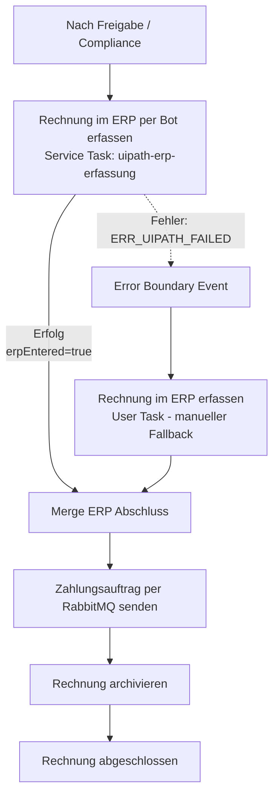
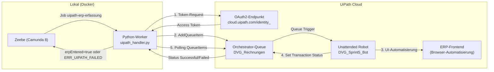

# Sprint 5 — UiPath RPA: Automatisierte ERP-Rechnungserfassung & Camunda-Integration

**Projekt:** DVG — Digitalisierung der Eingangsrechnungsbearbeitung
**Team:** Sam Haghighi, Efe Yueksel, Nick Rusnak, Abubakar Abdi Tube
**GitHub:** https://github.com/abab1016/DVG
**Dokumentationsstand:** Sprint 5 Abschlussdokumentation

---

## 1. Ziel des Sprints

Ziel von Sprint 5 war die **Automatisierung der ERP-Rechnungserfassung**, die in Sprint 4 noch ein rein manueller User Task war. Dafür wurde ein **UiPath RPA-Bot** entwickelt, der die Rechnungsdaten eigenständig in das ERP-Frontend einträgt.

Darüber hinaus wurde der Bot in den Camunda 8-Workflow eingebunden:

- Ein neues **BPMN-Prozessmodell** (`G7_Rechnungsfreigabe_with_UiPath.bpmn`) enthält einen Service Task, der den Bot ansteuert.
- Bei einem Bot-Fehler greift ein **Error Boundary Event**, das den Prozess nahtlos auf den manuellen ERP-User-Task umleitet.
- Der Python-Worker wurde um einen **Handler** (`uipath_handler.py`) erweitert, der den Job-Type `uipath-erp-erfassung` verarbeitet — entweder als echte Orchestrator-Integration (sobald die Zugangsdaten vorliegen) oder als vollständige Simulation für die Demo.

---

## 2. Ausgangslage

### 2.1 Stand nach Sprint 4

In Sprint 4 wurde der Rechnungsfreigabeprozess als ausführbarer Camunda-Workflow implementiert. Die ERP-Erfassung war dabei ein rein manueller Schritt:

1. Camunda legt den User Task `Rechnung im ERP erfassen` in der Tasklist an.
2. Der Sachbearbeiter öffnet das ERP-Frontend, trägt die Rechnungsdaten manuell ein und speichert.
3. Er bestätigt den Task in Camunda mit `erpEntered = true`.
4. Der Prozess läuft weiter zur Zahlung per RabbitMQ.

Sprint 5 ersetzt diesen manuellen Schritt durch einen automatisierten Bot-Lauf, behält den User Task aber als Fallback.

### 2.2 ERP-Simulationsseite

Das ERP-System ist eine Web-Anwendung auf Basis von LocalStorage:

```
https://anhe0003.github.io/this-and-that/ERP_Rechnungserfassung.html
```

Sie enthält:

- Kopfdaten-Felder: Rechnungsnummer, Rechnungsdatum, Lieferant, Kundennummer, Zahlungsziel, Kommentar
- Positions-Tabelle: Beschreibung, Menge, Einheit, Einzelpreis (Netto), Steuersatz (Dropdown), Gesamtbetrag (berechnet)
- Buttons: `+ Neue Rechnung`, `+ Position hinzufügen`, `Rechnung speichern / aktualisieren`
- Erfolgsprüfung: Sidebar-Liste „Rechnungen" — Eintrag erscheint nach erfolgreichem Speichern

---

## 3. Scope und Nicht-Scope

### 3.1 Umgesetzt in Sprint 5


| Bereich               | Inhalt                                                                                         |
| --------------------- | ---------------------------------------------------------------------------------------------- |
| UiPath-Bot            | `Solution 2.uis` — Bot öffnet ERP, füllt alle Felder, klickt Speichern, prüft Ergebnis     |
| BPMN-Erweiterung      | `G7_Rechnungsfreigabe_with_UiPath.bpmn` — Service Task + Error Boundary Event + Merge Gateway |
| Python-Handler        | `worker/src/handlers/uipath_handler.py` — verarbeitet Job `uipath-erp-erfassung`              |
| Echte API-Integration | OAuth2 + AddQueueItem in Orchestrator-Queue (wenn Credentials in`.env` gesetzt)                |
| Simulation            | Vollständige Demo-Simulation über Prozessvariable`simulateUiPathError`                       |
| Formular-Update       | `Rechnungs_Pruefung.form` — neue Checkbox zum Steuern der Simulation                          |
| Worker-Integration    | `uipath_handler` in `worker.py` registriert                                                    |
| Deploy-Skript         | `scripts/deploy_bmpn.py` deployt jetzt beide BPMN-Dateien                                      |
| Tests                 | 2 Unit-Tests in`test_uipath_handler.py`                                                        |
| Dokumentation         | Diese Datei +`docs/sprint5_uipath-integration.md`                                              |

### 3.2 Bewusst nicht umgesetzt


| Nicht umgesetzt                        | Begründung                                                                             |
| -------------------------------------- | --------------------------------------------------------------------------------------- |
| Produktiver Live-Betrieb der Bot-Kette | Bot-Eigentümer muss Queue-Item-Abfrage (`Get Transaction Item`) im XAML implementieren |
| Echte E-Mail-Integration               | bleibt Simulation, kein Mailserver                                                      |
| PDF-Extraktion                         | geplant für Sprint 6                                                                   |
| Produktives ERP-System                 | ERP bleibt Simulation auf Basis von LocalStorage                                        |

---

## 4. UiPath RPA-Bot

### 4.1 Bot-Übersicht


| Eigenschaft          | Wert                                                                   |
| -------------------- | ---------------------------------------------------------------------- |
| Paketdatei           | `Solution 2.uis` (UiPath Studio Web)                                   |
| Projektname          | `DVG_Sprint5_ERP_Rechnungserfassung_Bot`                               |
| Ausführungsumgebung | UiPath Cloud (Unattended Robot / Debug on Cloud)                       |
| Ziel-URL             | `https://anhe0003.github.io/this-and-that/ERP_Rechnungserfassung.html` |
| Browser              | Edge / Chrome (Chromium)                                               |

### 4.2 Bot-Ablauf (Main.xaml)

Der Bot führt folgende Schritte sequenziell aus:


| Schritt | ERP-Element                                | UiPath-Aktion                                             |
| ------- | ------------------------------------------ | --------------------------------------------------------- |
| 1       | Button`+ Neue Rechnung`                    | Click — Formular leeren                                  |
| 2       | Feld`Rechnungsnummer`                      | TypeInto mit Variable`in_InvoiceNumber`                   |
| 3       | Feld`Rechnungsdatum`                       | TypeInto mit Variable`in_InvoiceDate` (Format mm/dd/yyyy) |
| 4       | Feld`Lieferant`                            | TypeInto mit Variable`in_SupplierName`                    |
| 5       | Feld`Kundennummer`                         | TypeInto mit Variable`in_CustomerNumber`                  |
| 6       | Feld`Zahlungsziel`                         | TypeInto mit Variable`in_PaymentTerms`                    |
| 7       | Feld`Kommentar`                            | TypeInto mit Variable`in_Comment`                         |
| 8       | Button`+ Position hinzufügen`             | Click — neue Tabellenzeile                               |
| 9       | Feld`Beschreibung`                         | TypeInto mit Variable`in_PositionDescription`             |
| 10      | Feld`Menge`                                | TypeInto mit Variable`in_Quantity`                        |
| 11      | Feld`Einheit`                              | TypeInto mit Variable`in_Unit`                            |
| 12      | Feld`Einzelpreis (Netto)`                  | TypeInto mit Variable`in_UnitPriceNet`                    |
| 13      | Dropdown`Steuersatz`                       | Select (19%)                                              |
| 14      | Button`Rechnung speichern / aktualisieren` | Click                                                     |
| 15      | Sidebar`Rechnungen`                        | Element Exists — Erfolgsprüfung                         |

### 4.3 Bot-Variablen (Input Arguments)


| UiPath-Argument          | Typ    | Befüllt aus                                                     |
| ------------------------ | ------ | ---------------------------------------------------------------- |
| `in_InvoiceNumber`       | String | `invoiceNumber` (Camunda)                                        |
| `in_InvoiceDate`         | String | `invoiceDate` (ISO → mm/dd/yyyy konvertiert)                    |
| `in_SupplierName`        | String | `supplierName` (Camunda)                                         |
| `in_CustomerNumber`      | String | `customerNumber` (Camunda, Default: K-001)                       |
| `in_PaymentTerms`        | String | `dueDate` (Camunda, Default: 14 Tage netto)                      |
| `in_Comment`             | String | statisch: „Automatisch erfasst durch UiPath Bot via Camunda 8." |
| `in_PositionDescription` | String | `invoiceNumber` — „Dienstleistungen laut Rechnung ..."         |
| `in_Quantity`            | String | statisch: „1"                                                   |
| `in_Unit`                | String | statisch: „Stk."                                                |
| `in_UnitPriceNet`        | String | berechnet aus`amountNet` (2 Dezimalstellen)                      |

### 4.4 Fehlerbehandlung im Bot

- Alle kritischen Schritte sind in Try-Catch-Blöcke eingefasst.
- Bei einem fehlgeschlagenen Speichervorgang (Erfolgsprüfung negativ) wirft der Bot eine Exception.
- Das Ergebnis wird als Queue-Item-Status `Successful` oder `Failed` zurückgemeldet (wenn Queue-Anbindung aktiv).

---

## 5. BPMN-Erweiterung: `G7_Rechnungsfreigabe_with_UiPath.bpmn`

### 5.1 Prozessübersicht

Das neue BPMN-Modell erweitert den Sprint-4-Prozess um einen Bot-Aufruf vor dem manuellen ERP-User-Task:


| Eigenschaft | Wert                                                 |
| ----------- | ---------------------------------------------------- |
| Prozess-ID  | `Process_Rechnungsfreigabe_UiPath`                   |
| Prozessname | `Rechnungsfreigabeprozess mit UiPath-Bot`            |
| Plattform   | Camunda 8                                            |
| Basis       | `G7_Rechnungsfreigabe.bpmn` (Sprint 4, unverändert) |

### 5.2 Neue BPMN-Elemente (Sprint 5)


| BPMN-Element                       | Typ                  | ID                        | Funktion                                                           |
| ---------------------------------- | -------------------- | ------------------------- | ------------------------------------------------------------------ |
| `Rechnung im ERP per Bot erfassen` | Service Task         | `Task_UiPathERPErfassung` | Stellt Job`uipath-erp-erfassung` für den Python-Worker bereit     |
| `ERR_UIPATH_FAILED`                | Error Boundary Event | `Boundary_Error_UiPath`   | Fängt Bot-Fehler ab und leitet auf manuellen Fallback um          |
| `Merge ERP Abschluss`              | Exclusive Gateway    | `Gateway_MergeAfterERP`   | Führt erfolgreichen Bot-Pfad und manuellen Fallback-Pfad zusammen |
| `Rechnung im ERP erfassen`         | User Task            | (aus Sprint 4)            | Bleibt als manueller Fallback erhalten                             |

### 5.3 Prozessfluss (vereinfacht)



### 5.4 Rechnungs_Pruefung.form (Update)

Das Formular `Rechnungs_Pruefung.form` wurde um eine neue Checkbox erweitert:


| Feld                            | Variable              | Bedeutung                                                        |
| ------------------------------- | --------------------- | ---------------------------------------------------------------- |
| `UiPath-Bot-Fehler simulieren?` | `simulateUiPathError` | `true` → Handler wirft `ERR_UIPATH_FAILED` (Demo Fallback-Pfad) |

Diese Checkbox steuert ausschließlich den **Simulationspfad** des Handlers. Im echten Integrationsmodus (Zugangsdaten gesetzt) hat sie keine Wirkung.

---

## 6. Python-Worker: uipath_handler.py

### 6.1 Übersicht

**Datei:** `worker/src/handlers/uipath_handler.py`
**Job-Type:** `uipath-erp-erfassung`
**Timeout:** 300.000 ms (5 Minuten, erhöht für echten Bot-Lauf)
**Fehlercode:** `ERR_UIPATH_FAILED`

Der Handler arbeitet in **zwei Modi**, die zur Laufzeit automatisch anhand der Umgebungsvariablen gewählt werden:

### 6.2 Modus 1: Echte UiPath-Orchestrator-Integration

Wird aktiviert, wenn alle folgenden Umgebungsvariablen in `.env` gesetzt und keine Platzhalter sind:


| Variable               | Beschreibung                                              |
| ---------------------- | --------------------------------------------------------- |
| `UIPATH_CLIENT_ID`     | Client-ID der External App „Camunda" im UiPath-Mandanten |
| `UIPATH_CLIENT_SECRET` | Client-Secret (noch einzutragen)                          |
| `UIPATH_ORG`           | Organisationsname im UiPath-Cloud-Tenant                  |
| `UIPATH_TENANT`        | Tenant-Name (Standard:`Default`)                          |
| `UIPATH_FOLDER_ID`     | Folder-ID im Orchestrator (z.B. My Workspace)             |
| `UIPATH_QUEUE_NAME`    | Name der Orchestrator-Queue (z.B.`DVG_Rechnungen`)        |

**Ablauf im echten Modus:**

```
1. OAuth2-Token holen (grant_type: client_credentials, Scope: OR.Queues)
   → POST https://cloud.uipath.com/identity_/connect/token

2. Queue Item anlegen (Vorgang 5.4)
   → POST https://cloud.uipath.com/{org}/{tenant}/orchestrator_/odata/Queues/UiPathODataSvc.AddQueueItem
   → Body: { itemData: { Name, Priority, SpecificContent (Payload), Reference: "Camunda-{invoiceId}" } }
   → Antwort: Queue-Item-ID

3. Polling des Item-Status (Vorgang 5.5) — alle 5 Sekunden, max. 60 Versuche (5 Minuten)
   → GET https://cloud.uipath.com/{org}/{tenant}/orchestrator_/odata/QueueItems({id})
   → Status "Successful" → erpEntered = true, erpEntered = "SUCCESS"
   → Status "Failed" → BusinessError(ERR_UIPATH_FAILED, Fehlermeldung aus ProcessingException)
   → Timeout → BusinessError(ERR_UIPATH_FAILED)
```

**Payload (SpecificContent) des Queue Items:**

```json
{
  "invoiceNumber": "<aus Camunda>",
  "invoiceDate": "<aus Camunda>",
  "supplierName": "<aus Camunda>",
  "customerNumber": "K-001",
  "paymentTerms": "<dueDate aus Camunda>",
  "comment": "Automatisch erfasst durch UiPath Bot via Camunda 8.",
  "positionDescription": "Dienstleistungen laut Rechnung <invoiceNumber>",
  "quantity": "1",
  "unit": "Stk.",
  "unitPriceNet": "<amountNet formatiert auf 2 Dezimalstellen>"
}
```

### 6.3 Modus 2: Simulation (kein Credentials-Set)

Wenn die Umgebungsvariablen fehlen oder noch Platzhalter enthalten, läuft der Handler im Simulationsmodus:


| `simulateUiPathError` | Verhalten                                                                               |
| --------------------- | --------------------------------------------------------------------------------------- |
| `false` (Standard)    | Handler loggt alle Bot-Schritte simuliert, gibt`erpEntered = true` zurück              |
| `true`                | Handler loggt einen simulierten Speicherfehler, wirft`BusinessError(ERR_UIPATH_FAILED)` |

Dieser Modus ermöglicht eine vollständige Demo beider BPMN-Szenarien ohne echte UiPath-Credentials.

### 6.4 Rückgabewerte


| Variable          | Wert                                                             | Bedeutung                                       |
| ----------------- | ---------------------------------------------------------------- | ----------------------------------------------- |
| `erpEntered`      | `true`                                                           | ERP-Erfassung erfolgreich (Bot oder Simulation) |
| `uipathStatus`    | `"SUCCESS"`                                                      | Statuskennzeichen                               |
| `uipathRobotName` | z.B.`"Unattended-Robot"` oder `"UiPath-Bot-Sprint5 (Simuliert)"` | Name des ausführenden Roboters                 |

### 6.5 Registrierung im Worker

```python
# worker/src/worker.py
from handlers.uipath_handler import registriere_uipath_handler
...
registriere_uipath_handler(worker)
```

Der Handler wird zusammen mit allen anderen Handlern beim Systemstart registriert. Der Worker abonniert damit folgende Job-Types:

```
extract-pdf-metadata
save-invoice-metadata
send-payment-order
archive-invoice
send-information-request
uipath-erp-erfassung   ← neu in Sprint 5
```

---

## 7. Prozessvariablen (Sprint-5-Erweiterung)

Zusätzlich zu den Prozessvariablen aus Sprint 4 werden in Sprint 5 folgende Variablen genutzt:


| Variable              | Typ     | Bedeutung                                                                     |
| --------------------- | ------- | ----------------------------------------------------------------------------- |
| `simulateUiPathError` | Boolean | Steuert Fehler-Simulation im Demo-Modus (gesetzt in`Rechnungs_Pruefung.form`) |
| `erpEntered`          | Boolean | `true` nach erfolgreicher ERP-Erfassung (Bot oder manuell)                    |
| `uipathStatus`        | String  | `"SUCCESS"` nach Bot-Erfolg                                                   |
| `uipathRobotName`     | String  | Name des Roboters, der die Aufgabe ausgeführt hat                            |

Alle Sprint-4-Prozessvariablen bleiben unverändert erhalten (siehe `sprint4_workflow-implementierung.md`).

---

## 8. Architektur: Camunda → UiPath Orchestrator

Die Verbindung zwischen dem lokalen Camunda-Workflow und dem Cloud-basierten UiPath-Bot erfolgt über die **UiPath Orchestrator OData-API**:



**Warum Queue (Variante B) und nicht direkter StartJobs-Aufruf (Variante A)?**


| Kriterium          | Queue (Variante B)                             | StartJobs (Variante A)                    |
| ------------------ | ---------------------------------------------- | ----------------------------------------- |
| Entkopplung        | Bot-Ausführung ist asynchron, Puffer möglich | synchron, kein Puffer                     |
| Skalierung         | mehrere Robots können Items abarbeiten        | genau ein Robot                           |
| Rückmeldung       | Transaktions-Status pro Item                   | Rückgabe über Job-Variablen             |
| Anforderung an Bot | `Get Transaction Item` im XAML nötig          | `InputArguments` werden direkt übergeben |
| Implementiert      | Ja (`uipath_handler.py` Modus 1)               | Ja (Vorgänger-Code, nicht mehr primär)  |

---

## 9. Tests

### 9.1 Unit-Tests (uipath_handler)

**Datei:** `worker/src/tests/test_uipath_handler.py`
**Anzahl:** 2 Tests


| Test                                                | Beschreibung                                                              | Erwartetes Ergebnis                             |
| --------------------------------------------------- | ------------------------------------------------------------------------- | ----------------------------------------------- |
| `test_uipath_happy_path_gibt_erp_entered_zurueck`   | `simulateUiPathError = false`, keine Credentials → Simulation Happy Path | `erpEntered = true`, `uipathStatus = "SUCCESS"` |
| `test_uipath_fehler_simuliert_wirft_business_error` | `simulateUiPathError = true`, keine Credentials → Simulation Fehler      | `BusinessError(ERR_UIPATH_FAILED)` ausgelöst   |

### 9.2 Gesamte Test-Suite

```bash
python -m pytest grpc-service/tests/ client/src/tests/ zahlungssystem/src/tests/ worker/src/tests/ -v
```

Alle Tests laufen ohne laufende Dienste durch (Netzwerk wird gemockt, Zeebe wird nicht benötigt).

---

## 10. Deploy und Systemstart

### 10.1 BPMN-Deployment

Das Skript `scripts/deploy_bmpn.py` deployt automatisch beide BPMN-Prozesse und alle Formulare:

```bash
python scripts/deploy_bmpn.py
```

Deployete Ressourcen:

- `BPMN/G7_Rechnungsfreigabe.bpmn` (Sprint 4 — unverändert)
- `BPMN/G7_Rechnungsfreigabe_with_UiPath.bpmn` (Sprint 5 — neu)
- `BPMN/Forms/compliance-regeln.dmn`
- Alle `.form`-Dateien (inkl. aktualisierter `Rechnungs_Pruefung.form`)

### 10.2 Systemstart

```bash
bash scripts/start_all.sh
```

Startet: Zeebe/Camunda (Docker), gRPC-Service, RabbitMQ, Zahlungssystem, Python-Worker.

### 10.3 UiPath-Credentials (optionaler Live-Betrieb)

Um den echten Integrationsmodus zu aktivieren, muss `.env` im Wurzelverzeichnis folgendes enthalten:

```env
UIPATH_CLIENT_ID=<Client-ID der External App "Camunda">
UIPATH_CLIENT_SECRET=<Client-Secret eintragen>
UIPATH_ORG=<UiPath-Organisationsname>
UIPATH_TENANT=Default
UIPATH_FOLDER_ID=<Folder-ID im Orchestrator>
UIPATH_QUEUE_NAME=DVG_Rechnungen
```

Solange `UIPATH_CLIENT_SECRET` fehlt oder ein Platzhalter ist, läuft der Handler automatisch im Simulationsmodus.

---

## 11. Review-Demo: Schritt-für-Schritt

Die Demo zeigt beide Szenarien des BPMN-Modells mit UiPath-Erweiterung.

### 11.1 Vorbereitung

1. Infrastruktur starten: `bash scripts/start_all.sh`
2. BPMN deployen: `python scripts/deploy_bmpn.py`
3. Camunda Operate öffnen: `http://localhost:8081` (demo/demo)
4. Camunda Tasklist öffnen: `http://localhost:8082` (demo/demo)

### 11.2 Szenario 1 — Happy Path (Bot erfasst Rechnung automatisch)


| #  | Schritt                                                                                         | Wo                         |
| -- | ----------------------------------------------------------------------------------------------- | -------------------------- |
| 1  | Neue Instanz von**„Rechnungsfreigabeprozess mit UiPath-Bot"** starten                          | Tasklist / Portal-Formular |
| 2  | Instanz in Operate beobachten (Variablen:`metadataStored = true`)                               | Operate`:8081`             |
| 3  | User Task**„Rechnung prüfen & freigeben"** öffnen                                            | Tasklist`:8082`            |
| 4  | `Freigabeentscheidung = APPROVED` wählen                                                       | Tasklist                   |
| 5  | Checkbox**„UiPath-Bot-Fehler simulieren?"** DEAKTIVIERT lassen (`simulateUiPathError = false`) | Tasklist                   |
| 6  | Task abschließen (`Complete Task`)                                                             | Tasklist                   |
| 7  | Im Worker-Terminal beobachten: Bot-Simulation läuft durch (alle Felder geloggt)                | Terminal                   |
| 8  | Operate aktualisieren: Instanz läuft direkt vom Bot-Task zur Zahlung                           | Operate                    |
| 9  | Kein User Task „Rechnung im ERP erfassen" in Tasklist — Bot hat übernommen                   | Tasklist                   |
| 10 | Zahlungsauftrag (RabbitMQ) → Archivierung → End-Event                                         | Consumer-Log + Operate     |

**Kernaussage Szenario 1:** *Der Bot ersetzt den manuellen ERP-Schritt vollständig. Der Prozess läuft ohne Sachbearbeitereingabe durch.*

### 11.3 Szenario 2 — Fallback-Pfad (Bot schlägt fehl, manueller User Task übernimmt)


| #  | Schritt                                                                                      | Wo                         |
| -- | -------------------------------------------------------------------------------------------- | -------------------------- |
| 1  | Neue Instanz von**„Rechnungsfreigabeprozess mit UiPath-Bot"** starten                       | Tasklist / Portal-Formular |
| 2  | User Task**„Rechnung prüfen & freigeben"** öffnen                                         | Tasklist`:8082`            |
| 3  | `Freigabeentscheidung = APPROVED` wählen                                                    | Tasklist                   |
| 4  | Checkbox**„UiPath-Bot-Fehler simulieren?"** AKTIVIEREN (`simulateUiPathError = true`)       | Tasklist                   |
| 5  | Task abschließen (`Complete Task`)                                                          | Tasklist                   |
| 6  | Im Worker-Terminal beobachten: Bot simuliert Fehler, wirft`ERR_UIPATH_FAILED`                | Terminal                   |
| 7  | In Operate: Instanz läuft über**Error Boundary Event** in den Fallback-Pfad                | Operate                    |
| 8  | In Tasklist: User Task**„Rechnung im ERP erfassen"** erscheint für den Sachbearbeiter      | Tasklist                   |
| 9  | Sachbearbeiter öffnet ERP-Frontend, trägt Daten manuell ein, bestätigt`erpEntered = true` | ERP + Tasklist             |
| 10 | Prozess läuft regulär weiter (Zahlung → Archivierung → Abschluss)                        | Operate                    |

**Kernaussage Szenario 2:** *Der Prozess ist jederzeit stabil. Ein Bot-Fehler führt nicht zum Prozessabbruch, sondern zu einem kontrollierten manuellen Fallback.*

---

## 12. Fehlerbehandlung und Risiken

### 12.1 Fehlerbehandlung im Prozess


| Fehlerquelle                                          | Behandlung                                                 |
| ----------------------------------------------------- | ---------------------------------------------------------- |
| Bot-Fehler (ERP nicht erreichbar, Selektor ungültig) | `ERR_UIPATH_FAILED` → Error Boundary → User Task manuell |
| Fehlende UiPath-Credentials                           | Automatischer Wechsel in Simulationsmodus                  |
| OAuth2-Fehler (Token nicht abrufbar)                  | `ERR_UIPATH_FAILED` → Fallback                            |
| Queue-Item-Timeout (Bot antwortet nicht in 5 Min.)    | `ERR_UIPATH_FAILED` → Fallback                            |
| Unbekannter Queue-Item-Status                         | `ERR_UIPATH_FAILED` → Fallback                            |

### 12.2 Offene Punkte und Risiken


| #  | Risiko / Offener Punkt                                                                 | Auswirkung                                                                               | Verantwortlich           |
| -- | -------------------------------------------------------------------------------------- | ---------------------------------------------------------------------------------------- | ------------------------ |
| R1 | **Client-Secret** der External App fehlt in `.env`                                     | Echter Integrationsmodus nicht aktiv; Demo läuft im Simulationsmodus                    | UiPath-Account-Inhaber   |
| R2 | **Bot-XAML** muss `Get Transaction Item` implementieren, um Queue-Items zu verarbeiten | Ohne diesen Schritt landet das Queue-Item in der Queue, wird aber nicht verarbeitet      | Bot-Entwickler (Kollege) |
| R3 | ERP-Daten liegen im**Cloud-Robot-LocalStorage**                                        | Demo zeigt gespeicherten Eintrag aus dem letzten Bot-Lauf, nicht unbedingt den aktuellen | Demo-Hinweis             |
| R4 | BPMN-Änderungen erfordern Abstimmung mit den anderen Kollegen                         | Kein eigenmächtiges Anpassen fremder Workflow-Abschnitte                                | Teamabsprache            |

---

## 13. Bewertung des Ergebnisses

### 13.1 Erfüllte Akzeptanzkriterien


| Kriterium                                            | Status   | Nachweis                                                   |
| ---------------------------------------------------- | -------- | ---------------------------------------------------------- |
| UiPath-Bot entwickelt und testbar                    | Erfüllt | `Solution 2.uis`, Demo mit „Debug on Cloud"               |
| BPMN-Erweiterung mit Service Task und Error Boundary | Erfüllt | `G7_Rechnungsfreigabe_with_UiPath.bpmn`                    |
| Python-Handler für Job-Type`uipath-erp-erfassung`   | Erfüllt | `worker/src/handlers/uipath_handler.py`                    |
| Fallback auf manuellen User Task                     | Erfüllt | Error Boundary Event →`Rechnung im ERP erfassen`          |
| Simulation beider BPMN-Pfade ohne echte Credentials  | Erfüllt | `simulateUiPathError`-Steuerung                            |
| Echte API-Integration vorbereitet (OAuth2 + Queue)   | Erfüllt | `uipath_handler.py` Modus 1                                |
| Worker registriert neuen Handler                     | Erfüllt | `worker.py` — `registriere_uipath_handler`                |
| Tests vorhanden                                      | Erfüllt | `test_uipath_handler.py` — 2 Tests                        |
| Dokumentation erstellt                               | Erfüllt | diese Datei +`sprint5_uipath-integration.md`               |
| Review-Demo vorbereitet                              | Erfüllt | §11 — Beide Szenarien mit Schritt-für-Schritt-Anleitung |

### 13.2 Fachliche Bewertung

Sprint 5 schließt die in Sprint 4 offen gelassene Automatisierungslücke: Die ERP-Erfassung ist nicht mehr manuell, sondern wird durch einen RPA-Bot übernommen. Gleichzeitig bleibt der Prozess durch den Error Boundary Fallback stabil und für den Sachbearbeiter jederzeit nutzbar.

Die Camunda → UiPath-Integration über die Orchestrator-Queue ist vollständig implementiert und sofort scharf schaltbar, sobald das Client-Secret eingetragen wird. Der Bot-Eigentümer muss lediglich `Get Transaction Item` im XAML ergänzen, um den Kreis zu schließen.

### 13.3 Technische Bewertung

Die Architektur ist sauber getrennt:

- **Camunda** orchestriert den Prozess und wartet auf das Ergebnis.
- **Python-Worker** kapselt die gesamte UiPath-Kommunikation (OAuth2, AddQueueItem, Polling).
- **UiPath-Bot** führt die eigentliche UI-Automatisierung aus und schreibt das Ergebnis zurück.
- **Fehlerbehandlung** liegt vollständig im Prozessmodell (Boundary Event), nicht in der Anwendungsschicht.

---

## 14. Artefakte und Abgabe


| Artefakt                                  | Pfad                                         |
| ----------------------------------------- | -------------------------------------------- |
| Sprint-5-Hauptdokumentation               | `docs/sprint5_dokumentation.md`              |
| Technische Integrationsdokumentation      | `docs/sprint5_uipath-integration.md`         |
| BPMN Ursprungsprozess (Sprint 4)          | `BPMN/G7_Rechnungsfreigabe.bpmn`             |
| BPMN mit UiPath-Erweiterung (Sprint 5)    | `BPMN/G7_Rechnungsfreigabe_with_UiPath.bpmn` |
| Aktualisiertes Rechnungsprüfungsformular | `BPMN/Forms/Rechnungs_Pruefung.form`         |
| UiPath-Bot-Paket                          | `Solution 2.uis`                             |
| Python-Handler                            | `worker/src/handlers/uipath_handler.py`      |
| Handler-Tests                             | `worker/src/tests/test_uipath_handler.py`    |
| Worker (aktualisiert)                     | `worker/src/worker.py`                       |
| Deploy-Skript (aktualisiert)              | `scripts/deploy_bmpn.py`                     |
| Umgebungsvariablen-Vorlage                | `.env` (via `.gitignore` geschützt)         |

---

## 15. Übergabe an Sprint 6

Sprint 6 kann direkt auf dem Sprint-4/5-Workflow aufbauen:


| Übergabepunkt     | Stand nach Sprint 5                             | Sprint-6-Erweiterung                                                              |
| ------------------ | ----------------------------------------------- | --------------------------------------------------------------------------------- |
| Metadatenerfassung | manuelles Formular (`Metadaten_Erfassung.form`) | AI-Agent extrahiert Daten aus PDF, Formular bleibt als Kontroll-/Korrekturschritt |
| ERP-Erfassung      | automatisiert per Bot, Fallback manuell         | bleibt so (Sprint 5 abgeschlossen)                                                |
| gRPC-Speicherung   | Service Task funktioniert                       | bleibt unverändert                                                               |
| RabbitMQ-Zahlung   | Service Task funktioniert                       | bleibt unverändert                                                               |

---

## 16. Fazit

Sprint 5 liefert die vollständige RPA-Integration in den Camunda-Rechnungsfreigabeprozess:

- Der UiPath-Bot automatisiert die ERP-Erfassung zuverlässig.
- Das BPMN-Modell ist um Service Task und Error Boundary erweitert.
- Der Python-Worker verarbeitet den Job und kommuniziert mit dem Orchestrator.
- Die Demo zeigt beide Szenarien — automatischer Bot-Lauf und kontrollierten Fallback — vollständig und ohne echte Credentials.
- Die echte Orchestrator-Integration ist implementiert und braucht nur das Client-Secret, um live zu schalten.
