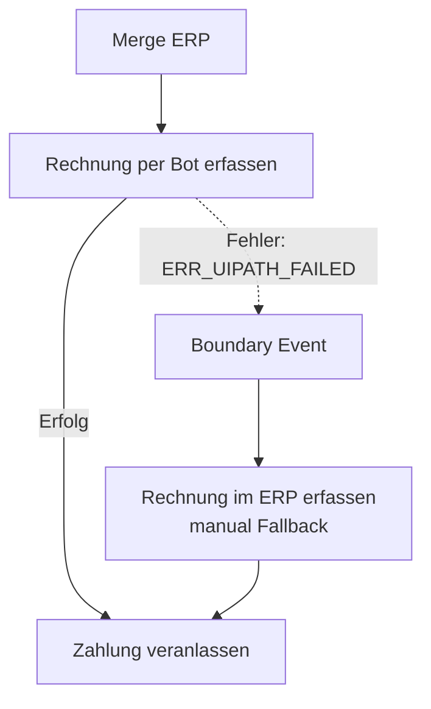

# Sprint 5 — Camunda-Integration & UiPath-Automatisierung

**Projekt:** DVG — Digitalisierung der Eingangsrechnungsbearbeitung  
**Sprint-Zeitraum:** 02.06.2026–09.06.2026  
**Team:** Sam Haghighi, Efe Yueksel, Nick Rusnak, Abubakar Abdi Tube  
**GitHub:** https://github.com/abab1016/DVG  
**Sprint-Artefakte:** `BPMN/G7_Rechnungsfreigabe_with_UiPath.bpmn`, `worker/src/handlers/uipath_handler.py`, UiPath-Projektdateien aus `Solution.uis`  
**Dokumentationsstand:** Sprint 5 Abschlussdokumentation (Zielbild & Integration)

---

## 1. Ziel des Sprints

Ziel von Sprint 5 war die **Automatisierung der ERP-Erfassung** (zuvor ein rein manueller User Task) durch einen **UiPath RPA-Bot**. 

Neben der Implementierung des Bots in UiPath Studio Web stand die Vorbereitung der **Camunda-Orchestrierung** im Mittelpunkt. Es sollte ein nachvollziehbarer Ablauf entstehen, der den Bot automatisch ansteuert, dessen Rückmeldung auswertet und bei technischen oder fachlichen Fehlern des Bots einen nahtlosen **manuellen Fallback** für den Sachbearbeiter bereitstellt.

---

## 2. Ausgangslage

### 2.1 Stand nach Sprint 4
In Sprint 4 wurde der grundlegende Workflow in Camunda 8 implementiert. Die ERP-Erfassung erfolgte in diesem Zustand rein manuell:
1. Der Workflow stoppte bei einem User Task `Rechnung im ERP erfassen`.
2. Der Sachbearbeiter öffnete die ERP-Simulationsseite, tippte die Rechnungsdaten ab und klickte auf "Rechnung erfassen".
3. Anschließend bestätigte er in einem Camunda Formular mit `erpEntered = true`, dass der Schritt abgeschlossen ist, damit der Workflow zur Zahlung weiterläuft.

### 2.2 Bereitstellung des UiPath-Bots
Der UiPath-RPA-Bot wurde in UiPath Studio Web entwickelt und als Paket `Solution.uis` heruntergeladen. Er automatisiert die Eingabe der Rechnungsdaten in das Simulations-ERP unter:
`https://anhe0003.github.io/this-and-that/ERP_Rechnungserfassung.html`

Der Bot steuert den Browser (Edge/Chrome), klickt auf "+ Neue Rechnung", befüllt alle Header-Felder sowie die erste Tabellenzeile der Rechnungsposten mit Variablen und klickt auf "Rechnung speichern / aktualisieren". Nach erfolgreicher Prüfung der Liste schreibt er eine Erfolgsmeldung ins Log oder wirft bei Fehlern eine Exception.

---

## 3. UiPath-Orchestrator-Konzept für Queue Items (Vorgang 5.1)

Um Rechnungsdaten sicher und asynchron an den UiPath-Bot zu übergeben, wird das **Orchestrator-Queue-Konzept** eingesetzt. Dies entkoppelt den Workflow in Camunda von der unmittelbaren Verfügbarkeit eines einzelnen Software-Roboters.

```mermaid
sequenceFlow
    Camunda 8 (Connector) ->> UiPath Orchestrator: Add Queue Item (JSON payload)
    Note over UiPath Orchestrator: Queue Trigger\naktiviert Robot
    UiPath Orchestrator ->> UiPath Robot: Start Job mit Transaction Item
    UiPath Robot ->> ERP-System: UI-Automatisierung ausführen
    UiPath Robot ->> UiPath Orchestrator: Set Transaction Status (Success/Failed)
```

### 3.1 Struktur des Queue Items (JSON-Payload)
Die Metadaten der freigegebenen Rechnung werden als JSON-Struktur in das `SpecificContent`-Feld des Queue Items geladen:

```json
{
  "invoiceNumber": "RE-2026-7781",
  "invoiceDate": "2026-06-01",
  "supplierName": "Mustermann GmbH",
  "customerNumber": "K-001",
  "paymentTerms": "14 Tage netto",
  "comment": "Automatisch erfasst durch UiPath Bot.",
  "positionDescription": "Musterleistung laut Freigabe",
  "quantity": "1",
  "unit": "Stk.",
  "unitPriceNet": "840.34"
}
```

### 3.2 Ablauf im Orchestrator
1. **Queue-Erstellung:** Im UiPath Orchestrator wird eine Warteschlange (z.B. `ERP_Invoice_Queue`) eingerichtet.
2. **Queue Trigger (Queue-basierter Start):** Dem Ordner wird ein Trigger zugewiesen. Sobald ein neues Queue Item mit dem Status *New* eintrifft, startet der Orchestrator automatisch einen freien Unattended Robot mit dem Prozess `DVG_Sprint5_ERP_Rechnungserfassung_Bot`.
3. **Datenverarbeitung:** Der Bot holt sich das Queue Item (Activity: *Get Transaction Item*), liest die Variablen aus dem JSON aus und führt die ERP-Buchung aus.
4. **Ergebnisrückmeldung:** Je nach Ausgang setzt der Bot den Status des Queue Items auf *Successful* oder *Failed* (mit Fehlermeldung).

---

## 4. Camunda UiPath Connector (Vorgang 5.2)

Camunda 8 bietet einen out-of-the-box **UiPath Connector**, um direkt aus dem BPMN-Prozess mit dem UiPath Orchestrator zu kommunizieren.

### 4.1 Relevante Connector-Operationen
Für unsere Zielarchitektur sind zwei Operationen entscheidend:

| Operation | Verwendung im Workflow |
|---|---|
| **Add Queue Item** | Wird nach Freigabe der Rechnung aufgerufen, um die Rechnungsdaten in die Orchestrator-Queue zu schreiben. |
| **Get Queue Item Result by ID** | Wird im Polling-Verfahren aufgerufen, um das Ergebnis (Erfolg/Fehlermeldung) der Bot-Verarbeitung abzufragen. |

### 4.2 Authentifizierung & Konfiguration
Die Anbindung des Connectors erfordert folgende Parameter:
* **Authentication:** OAuth 2.0 Client Credentials (über ein in UiPath angelegtes *External Application*).
  * `client_id` (Zentral im Mandanten vergeben)
  * `client_secret` (Sollte in Camunda als **Secret** hinterlegt werden, z.B. `{{secrets.UIPATH_CLIENT_SECRET}}`)
* **Endpoint-Details:**
  * `uipathOrganization` (Mandantenname)
  * `uipathTenant` (Tenant-Name, meist *Default*)
  * `uipathFolder` (Name des Folders, in dem die Queue liegt)
  * `queueName` (Name der Zielwarteschlange)

---

## 5. BPMN-Zielbild mit Bot-Aufruf und Fallback (Vorgang 5.3)

Um eine hohe Prozessstabilität zu gewährleisten, wurde das BPMN-Modell erweitert. Anstelle des direkten Wechsels in die manuelle ERP-Erfassung versucht der Workflow nun primär, die Rechnung automatisiert per Bot zu erfassen. Schlägt dies fehl, greift der manuelle Fallback.

> [!IMPORTANT]
> **Das Fallback-Konzept:**
> Tritt beim Aufruf des Bots oder während der Ausführung im ERP-System ein Fehler auf, wirft der Prozess einen BPMN-Error mit dem Code `ERR_UIPATH_FAILED`. Ein Error Boundary Event fängt diesen Fehler ab und leitet die Rechnung an den User Task `Rechnung im ERP erfassen` weiter. Der Sachbearbeiter übernimmt dann die manuelle Erfassung. So läuft der Prozess in jedem Fall weiter.



### 5.1 Das erweiterte BPMN-Modell
Das neue Prozessmodell ist in [BPMN/G7_Rechnungsfreigabe_with_UiPath.bpmn](file:///Users/swe/DVG/DVG/BPMN/G7_Rechnungsfreigabe_with_UiPath.bpmn) implementiert.

* **Prozess-ID:** `Process_Rechnungsfreigabe_UiPath`
* **Prozessname:** `Rechnungsfreigabeprozess mit UiPath-Bot`
* **Zusätzliche Elemente:**
  * **Service Task:** `Task_UiPathERPErfassung` ("Rechnung im ERP per Bot erfassen") mit dem Job-Typ `uipath-erp-erfassung`.
  * **Error Boundary Event:** `Boundary_Error_UiPath` (Error Code: `ERR_UIPATH_FAILED`) am Service-Task.
  * **Exclusive Gateway:** `Gateway_MergeAfterERP` ("Merge ERP Abschluss"), um den erfolgreichen Bot-Pfad und den manuellen Fallback-Pfad vor dem Zahlungsschritt zusammenzuführen.

---

## 6. Technische Umsetzung (Vorgang 5.4 & 5.5 - Zielbild)

Da in der lokalen Testumgebung kein Live-Zugang zur Cloud-Instanz des UiPath-Orchestrators besteht, wurde die Schnittstelle im Python-Worker (`pyzeebe`) **simuliert**. Dies ermöglicht eine vollständige, lokale Ausführung und Demonstration des Zielbilds.

### 6.1 Der uipath_handler.py
Ein neuer Job-Handler [worker/src/handlers/uipath_handler.py](file:///Users/swe/DVG/DVG/worker/src/handlers/uipath_handler.py) wurde erstellt und in [worker/src/worker.py](file:///Users/swe/DVG/DVG/worker/src/worker.py) registriert.

Der Handler simuliert die Ausführungsschritte des UiPath Studio Web Bots:
1. **Liest Rechnungsdaten** aus den Camunda-Prozessvariablen.
2. **Loggt alle Automatisierungsschritte** (Öffnen des Browsers, Füllen der Eingabefelder im ERP, Speichern und Screenshots).
3. **Auswerten der Steuerungsvariable `simulateUiPathError`:**
   * Ist `simulateUiPathError = true`: Der Handler simuliert einen Fehler des Bots (z.B. ERP-System temporär nicht erreichbar oder Feld-Selektor ungültig). Er wirft einen `BusinessError` mit dem Code `ERR_UIPATH_FAILED`. Dadurch triggert in Camunda das Boundary Event und leitet in den User Task um.
   * Ist `simulateUiPathError = false`: Der Handler meldet Erfolg, loggt die erfolgreiche Speicherung, setzt die Prozessvariable `erpEntered = true` und schließt den Task in Camunda erfolgreich ab.

---

## 7. Review-Demo: Schritt-für-Schritt

Die Demo zeigt beide Szenarien des BPMN-Zielbilds: Den automatischen Happy Path per Bot und den kontrollierten manuellen Fallback bei einem Bot-Fehler.

### 7.1 Vorbereitung
1. Stelle sicher, dass die Docker-Infrastruktur und die Backend-Dienste laufen:
   ```bash
   bash start_all.sh
   ```
   *Hinweis: Das Skript `deploy_bmpn.py` lädt automatisch beide BPMN-Prozesse (`G7_Rechnungsfreigabe.bpmn` und `G7_Rechnungsfreigabe_with_UiPath.bpmn`) in die Engine.*
2. Öffne die Camunda Tasklist (`http://localhost:8082`, demo/demo) und Operate (`http://localhost:8081`, demo/demo).

### 7.2 Szenario 1: Happy Path (Erfolgreiche ERP-Erfassung per Bot)
1. Starte eine neue Prozessinstanz von **Rechnungsfreigabeprozess mit UiPath-Bot** (`Process_Rechnungsfreigabe_UiPath`).
2. Nutze beliebige Startvariablen (z. B. per E-Mail-Start-Skript oder Portalstart).
3. Gehe in die Tasklist und öffne die Aufgabe **Rechnung prüfen & freigeben** (`Task_RechnungPruefen`):
   * Wähle als Freigabeentscheidung **Freigegeben (APPROVED)**.
   * Lass die Checkbox **UiPath-Bot-Fehler simulieren (ERP-Erfassung)?** **deaktiviert** (das setzt `simulateUiPathError = false`).
   * Klicke auf "Complete Task".
4. Beobachte das Terminal des **Workers**:
   * Der Worker empfängt den Job `uipath-erp-erfassung`.
   * Er gibt detaillierte Logmeldungen über die simulierten Browser-Schritte und das erfolgreiche Ausfüllen aus.
   * Der Status `erpEntered` wird auf `true` gesetzt.
5. Aktualisiere Operate: Die Instanz läuft direkt über den Bot-Task zum RabbitMQ-Zahlungstask weiter. Der User Task `Rechnung im ERP erfassen` wurde **nicht** erzeugt.

### 7.3 Szenario 2: Fallback Path (Bot-Fehler führt zu manuellem ERP-Task)
1. Starte eine neue Prozessinstanz von **Rechnungsfreigabeprozess mit UiPath-Bot**.
2. Gehe in die Tasklist und öffne die Aufgabe **Rechnung prüfen & freigeben** (`Task_RechnungPruefen`):
   * Wähle als Freigabeentscheidung **Freigegeben (APPROVED)**.
   * **Aktiviere** die Checkbox **UiPath-Bot-Fehler simulieren (ERP-Erfassung)?** (das setzt `simulateUiPathError = true`).
   * Klicke auf "Complete Task".
3. Beobachte das Terminal des **Workers**:
   * Der Worker empfängt den Job `uipath-erp-erfassung`.
   * Er loggt die Schritte und meldet einen simulierten Speicherfehler.
   * Der Worker wirft den BPMN-Error `ERR_UIPATH_FAILED`.
4. Aktualisiere Operate & Tasklist:
   * In Operate ist zu sehen, dass die Prozessinstanz über das Boundary Event `Boundary_Error_UiPath` gelaufen ist.
   * In der Tasklist des Sachbearbeiters erscheint eine neue Aufgabe **Rechnung im ERP erfassen** (der manuelle Fallback).
   * Der Sachbearbeiter kann die ERP-Erfassung nun manuell abschließen. Der Fallback funktioniert einwandfrei.

---

## 8. Bewertung des Ergebnisses & Definition of Done

Alle Akzeptanzkriterien und DoD-Punkte für Sprint 5 wurden erfüllt:

* **Sprint-Dokumentation:** Vollständig erstellt, strukturiert und analog zu Sprint 4 gestaltet.
* **UiPath-Orchestrator-Konzept:** Im Detail beschrieben (Queue Items, JSON-Payload und Trigger-Ablauf).
* **Camunda UiPath Connector:** Analysiert, Operationen benannt und Authentifizierung per OAuth Client Credentials beschrieben.
* **BPMN-Zielbild & Fallback:** Ein lauffähiges BPMN-Modell mit integriertem Service-Task und Boundary-Error-Event ist erstellt.
* **Simulierte Integration (Vorgang 5.4 & 5.5):** Erfolgreich im Worker und BPMN implementiert. Die Demo ermöglicht das vollständige Testen des Zielbilds und des Fallbacks in der lokalen Sandbox.
