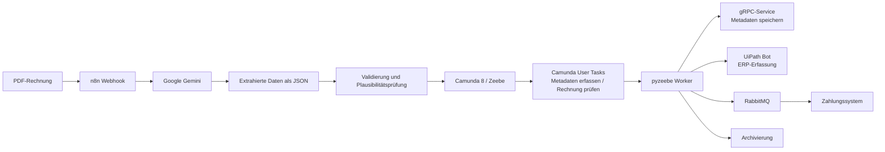
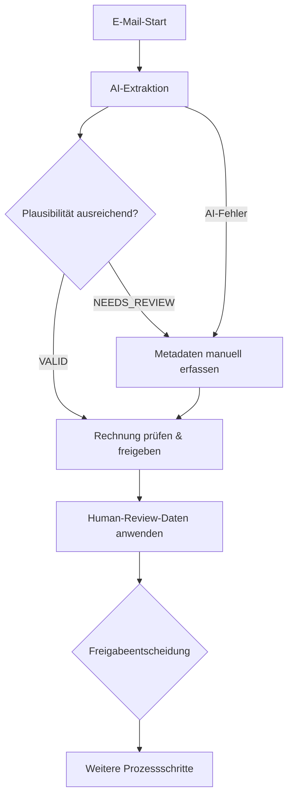

# Sprint 6 – AI-gestützte Extraktion von Rechnungsinformationen

**Projekt:** DVG – Digitalisierung der Eingangsrechnungsbearbeitung  
**Veranstaltung:** Digitalisierung von Geschäftsprozessen  
**Sprint:** 6  
**Team:** Sam Haghighi, Efe Yueksel, Nick Rusnak, Abubakar Abdi Tube  
**Repository:** `abab1016/DVG`  
**Stand:** Finale Sprint-6-Dokumentation  

---

## 1. Zielsetzung

In Sprint 6 wurde der bestehende digitale Rechnungsfreigabeprozess um eine AI-gestützte Vorverarbeitung von Rechnungen erweitert. Ziel war, Rechnungsinformationen aus PDF-Dateien automatisiert zu extrahieren, die Qualität der Extraktion zu bewerten und unsichere Ergebnisse kontrolliert in den bestehenden Camunda-Prozess zu überführen.

Der Sprint ersetzt weder den Camunda-Workflow noch die bereits implementierten Integrationsbausteine. Stattdessen ergänzt er den Prozess vor der bisherigen manuellen Metadatenerfassung:

```text
PDF-Rechnung
→ n8n AI Workflow
→ Google Gemini
→ strukturierte Rechnungsdaten
→ Plausibilitätsprüfung
→ bei Bedarf manuelle Metadatenerfassung
→ Rechnungsprüfung und Freigabe
→ gRPC-Metadatenspeicherung
→ ERP-Erfassung per UiPath
→ Zahlungsauftrag per RabbitMQ
→ Archivierung
```

Damit werden unstrukturierte Rechnungsdokumente früh in strukturierte Prozessdaten überführt. Fachlich kritische Entscheidungen und Korrekturen bleiben weiterhin beim Menschen.

---

## 2. Ausgangslage aus Sprint 1 bis Sprint 5

| Sprint | Ergebnis | Bedeutung für Sprint 6 |
|---|---|---|
| Sprint 1 | gRPC-Service, RabbitMQ, Zahlungssystem und Client | Die extrahierten Rechnungsdaten werden weiter per gRPC gespeichert; Zahlungsaufträge werden weiterhin über RabbitMQ verarbeitet. |
| Sprint 2 | Process Mining und Analyse des Ist-Prozesses | Manuelle Datenerfassung und Medienbrüche wurden als relevante Optimierungspotenziale identifiziert. |
| Sprint 3 | Soll-Prozess und Zielarchitektur | Camunda wurde als zentrale Workflow Engine und Orchestrierungskomponente vorgesehen. |
| Sprint 4 | Camunda-Workflow mit Formularen, gRPC, Zahlung, Archivierung und Fehlerpfaden | Sprint 6 erweitert diesen Workflow um eine AI-Vorverarbeitung und nutzt die bestehenden User Tasks weiter. |
| Sprint 5 | UiPath-Bot für die ERP-Erfassung | Der Bot verwendet weiterhin die finalen, im Prozess geprüften Rechnungsdaten. |

---

## 3. Umsetzung im Repository

### 3.1 Relevante Sprint-6-Artefakte

| Artefakt | Aufgabe |
|---|---|
| `BPMN/G7_Rechnungsfreigabe_with_AI.bpmn` | Aktuelles ausführbares BPMN-Modell mit AI-Extraktion, Plausibilitäts-Gateway und Fehlerpfaden |
| `n8n/workflows/sprint6_ai_extraction.json` | Importierbarer n8n-Workflow für PDF-Analyse mit Gemini |
| `worker/src/handlers/ai_extraction_handler.py` | Ruft den n8n-Webhook aus dem Camunda Worker auf |
| `worker/src/mapping/ai_extraction_mapping.py` | Prüft, normalisiert und mappt AI-Daten zu Camunda-Prozessvariablen |
| `worker/src/handlers/human_review_handler.py` | Übernimmt korrigierte Werte aus dem Human Review in die finalen Prozessdaten |
| `Rechnungsdaten/demo/rechnung_happy_path.pdf` | Testrechnung für einen vollständigen Happy Path |
| `Rechnungsdaten/demo/rechnung_human_review.pdf` | Testrechnung für einen Fall mit manueller Nachbearbeitung |
| `scripts/ai_failure.*` | Simuliert einen n8n-/AI-Ausfall und testet den BPMN-Fallback |
| `README.md` | Zentraler Start-, Import-, Test- und Demo-Leitfaden |

---

## 4. Architektur

Die AI-Komponente wird nicht als autonomer Ersatz für den Geschäftsprozess eingesetzt. Sie ist ein klar abgegrenzter AI Workflow innerhalb einer zentral orchestrierten Prozessarchitektur.



### Komponenten und Verantwortlichkeiten

| Komponente | Verantwortung |
|---|---|
| **n8n** | Empfang der Datei-Referenz, Einlesen der PDF und Orchestrierung der AI-Dokumentanalyse |
| **Google Gemini** | Extraktion von Rechnungsinformationen aus dem PDF-Inhalt |
| **AI-Mapping/Validierung** | Prüfung der extrahierten Felder, Confidence-Werte, Betragslogik und Dateikonsistenz |
| **Camunda 8 / Zeebe** | Zentrale Steuerung des Prozessablaufs und der Fehler-/Fallback-Pfade |
| **Camunda Tasklist** | Menschliche Bearbeitung von Metadaten, Rechnungsprüfung und Freigabe |
| **pyzeebe Worker** | Technische Umsetzung der Service Tasks und Kommunikation mit n8n, gRPC, UiPath, RabbitMQ und Archivierung |
| **gRPC-Service** | Persistierung der Rechnungsmetadaten |
| **UiPath** | UI-basierte Erfassung der finalen Rechnungsdaten im ERP-Frontend |
| **RabbitMQ + Zahlungssystem** | Asynchrone Übergabe und Verarbeitung von Zahlungsaufträgen |
| **Archivierung** | Speicherung des Abschlussstatus und der Rechnungsdaten als Laufzeitartefakte |

---

## 5. AI Workflow mit n8n und Gemini

Der n8n-Workflow liegt als exportierbare Datei unter:

```text
n8n/workflows/sprint6_ai_extraction.json
```

Er wird einmalig in n8n importiert und aktiviert. Der Einstieg erfolgt über einen `POST`-Webhook mit dem Pfad:

```text
/webhook/sprint6-ai-extraction
```

Der Workflow verarbeitet die Datei aus dem gemounteten Verzeichnis `Rechnungsdaten/` und führt folgende Schritte aus:

1. Webhook empfängt den Dateinamen.
2. n8n liest die PDF aus `/data/<fileName>`.
3. n8n erstellt die Anfrage für Google Gemini.
4. Gemini analysiert die Rechnung.
5. Die Antwort wird bereinigt, in JSON überführt und an den Worker zurückgegeben.

Die AI-Ausgabe enthält mindestens:

```json
{
  "invoiceId": "INV-2026-001",
  "invoiceNumber": "RE-2026-001",
  "supplierName": "Beispiel Lieferant GmbH",
  "invoiceDate": "2026-06-15",
  "dueDate": "2026-06-29",
  "amountNet": 1000.00,
  "amountGross": 1190.00,
  "currency": "EUR",
  "iban": "DE...",
  "billingAddress": "Beispielstraße 1, 76133 Karlsruhe",
  "invoiceItems": [
    {
      "description": "Dienstleistung",
      "quantity": 1,
      "unitPrice": 1000.00,
      "netAmount": 1000.00,
      "taxRate": 19,
      "grossAmount": 1190.00
    }
  ],
  "confidence": {},
  "sourceFile": "rechnung.pdf",
  "extractionEngine": "n8n+gemini-2.5-flash"
}
```

Die tatsächliche Extraktion ist abhängig von Dokumentqualität, Prompt, Modellantwort und API-Verfügbarkeit. Deshalb wird die AI-Antwort nie ungeprüft als fachlich korrekt angenommen.

---

## 6. Datenvertrag, Validierung und Plausibilität

### 6.1 Pflichtfelder

Folgende Felder werden im Worker als Pflichtfelder betrachtet:

- `invoiceId`
- `invoiceNumber`
- `supplierName`
- `invoiceDate`
- `amountGross`
- `currency`
- `iban`
- `billingAddress`

Zusätzlich werden optionale Felder wie `dueDate`, `amountNet`, `supplierEmail` und `invoiceItems` verarbeitet, sofern sie vorhanden sind.

### 6.2 Validierungsregeln

Die Plausibilitätslogik prüft insbesondere:

1. Alle Pflichtfelder sind vorhanden und nicht leer.
2. Für jedes Pflichtfeld liegt ein Confidence-Wert vor.
3. Der Confidence-Wert eines Pflichtfelds erreicht mindestens die definierte Schwelle von `0.85`.
4. Netto- und Bruttobetrag sind numerisch und nicht negativ.
5. Der Bruttobetrag ist nicht kleiner als der Nettobetrag.
6. Die Währung besteht aus drei Großbuchstaben, z. B. `EUR`.
7. Die extrahierte Rechnungs-ID passt – sofern möglich – zur ID im Dateinamen.

Das Ergebnis wird als Prozessvariable abgelegt:

| Prozessvariable | Bedeutung |
|---|---|
| `aiPlausibilityStatus = VALID` | Daten sind vollständig und plausibel genug für den weiteren Prozess |
| `aiPlausibilityStatus = NEEDS_REVIEW` | Mindestens eine Prüfung ist fehlgeschlagen; manuelle Metadatenerfassung ist erforderlich |
| `aiReviewGruende` | Liste der konkreten Gründe für die manuelle Nachbearbeitung |

---

## 7. Anpassung des Camunda-Workflows

Das aktuelle Modell `G7_Rechnungsfreigabe_with_AI.bpmn` erweitert den E-Mail-Start des Prozesses um einen Service Task zur AI-Extraktion.



### Verhalten der Pfade

| Situation | BPMN-Verhalten |
|---|---|
| AI-Ausgabe ist plausibel | Der Prozess führt direkt zur bestehenden Aufgabe **„Rechnung prüfen & freigeben“**. |
| `NEEDS_REVIEW` | Der Prozess führt zuerst zu **„Metadaten manuell erfassen“** und danach zur Prüfung/Freigabe. |
| AI/n8n nicht erreichbar | Der technische Fehler `ERR_AI_EXTRACTION` wird über ein Boundary Event behandelt; der Prozess fällt auf die manuelle Metadatenerfassung zurück. |
| Prüfer korrigiert Daten | Der Service Task **„Human-Review-Daten anwenden“** übernimmt die freigegebenen bzw. korrigierten Werte als finale Prozessdaten. |

Dadurch bleibt der Prozess auch dann fachlich ausführbar, wenn die AI-Extraktion unvollständig oder technisch nicht verfügbar ist.

---

## 8. Weiterverarbeitung nach dem Human Review

Nach der Prüfung und Freigabe verwendet der Prozess ausschließlich die finalen, durch den Menschen bestätigten Prozessdaten.

Die Weiterverarbeitung erfolgt unverändert über die bestehenden Integrationsbausteine:

1. **gRPC:** Rechnungsmetadaten werden gespeichert.
2. **Compliance:** Falls erforderlich, werden die vorhandenen DMN-/Compliance-Schritte genutzt.
3. **UiPath:** Der RPA-Bot trägt die Rechnungsdaten im ERP-Frontend ein.
4. **RabbitMQ:** Ein Zahlungsauftrag wird asynchron an das Zahlungssystem gesendet.
5. **Archivierung:** Der Abschluss des Vorgangs wird gespeichert.

Damit ist AI kein separater Parallelprozess, sondern ein kontrollierter Input-Lieferant für den bestehenden End-to-End-Workflow.

---

## 9. Fehlerbehandlung und Fallbacks

Für zentrale technische Komponenten sind im BPMN Error Boundary Events und manuelle Ersatzschritte vorgesehen.

| Komponente | Automatische Versuche | Manueller Fallback |
|---|---:|---|
| AI / n8n | 1 | Metadaten manuell erfassen |
| gRPC | 3 | Metadaten manuell speichern |
| UiPath / ERP | 1 | Rechnung manuell im ERP erfassen |
| RabbitMQ / Zahlung | 3 | Zahlung manuell erfassen |
| Archivierung | 3 | Rechnung manuell archivieren |

Die Ausfälle können für die Demo über die Skripte unter `scripts/` simuliert werden, ohne reale Dienste absichtlich herunterzufahren.

Beispiele:

```bash
# Windows
scripts\ai_failure.bat fail
scripts\ai_failure.bat restore

# macOS / Linux
./scripts/ai_failure.sh fail
./scripts/ai_failure.sh restore
```

---

## 10. Demonstration

### 10.1 Voraussetzungen

- Docker Desktop läuft.
- `plattform.txt` enthält `windows` oder `mac`.
- Eine lokale `.env` enthält mindestens `GEMINI_API_KEY`; für die vollständige ERP-Automatisierung zusätzlich die UiPath-Zugangsdaten.
- Der n8n-Workflow wurde importiert und aktiviert.
- gRPC-Stubs wurden erzeugt.

### 10.2 System starten

```bash
# Windows
scripts\install.bat
scripts\start_all.bat

# macOS / Linux
chmod +x scripts/install.sh
./scripts/install.sh
./scripts/start_all.sh
```

Der Start umfasst Zeebe, Operate, Tasklist, RabbitMQ, Elasticsearch, n8n, gRPC-Service, Worker und RabbitMQ-Consumer.

### 10.3 Happy Path demonstrieren

1. System starten.
2. Sicherstellen, dass der n8n-Workflow aktiv ist.
3. Testprozess starten:

```bash
# Windows
python scripts/auto_email_start.py

# macOS / Linux
python3 scripts/auto_email_start.py
```

4. In n8n die erfolgreiche Dokumentanalyse zeigen.
5. In der Camunda Tasklist die Aufgabe **„Rechnung prüfen & freigeben“** öffnen.
6. Rechnung prüfen und freigeben.
7. In Operate den Prozessverlauf zeigen.
8. ERP-Erfassung, Zahlungslog und Archivierung nachweisen.

### 10.4 Human-Review-Fall demonstrieren

1. Die Demo-Rechnung `Rechnungsdaten/demo/rechnung_human_review.pdf` verwenden.
2. Das AI-Ergebnis erzeugt eine unvollständige oder unplausible Datenlage.
3. `aiPlausibilityStatus = NEEDS_REVIEW` führt zu **„Metadaten manuell erfassen“**.
4. Fehlende oder unklare Werte korrigieren.
5. Anschließend die Rechnung prüfen und freigeben.
6. Den weiteren Prozessverlauf bis Zahlung und Archivierung zeigen.

### 10.5 AI-Ausfall demonstrieren

1. AI-Fehler simulieren:

```bash
scripts\ai_failure.bat fail
```

2. Einen Prozess starten.
3. Nachweisen, dass der Prozess nicht abbricht, sondern in die manuelle Metadatenerfassung wechselt.
4. Fehlerstatus wieder zurücksetzen:

```bash
scripts\ai_failure.bat restore
```

---

## 11. Tests und Qualitätssicherung

Die automatisierten Tests können ohne laufendes Gesamtsystem ausgeführt werden, da externe Services gemockt werden.

```bash
python -m pytest worker/src/tests/ grpc-service/tests/ client/src/tests/ zahlungssystem/src/tests/ -v
```

Für Sprint 6 sind insbesondere folgende Prüfungen relevant:

- AI-Antwort wird korrekt zu Prozessvariablen gemappt.
- Fehlende Pflichtfelder erzeugen `NEEDS_REVIEW`.
- Niedrige Confidence-Werte erzeugen `NEEDS_REVIEW`.
- Unplausible Betragskonstellationen werden erkannt.
- AI-/n8n-Ausfall führt zum manuellen BPMN-Fallback.
- Korrigierte Human-Review-Daten werden als finale Prozessdaten verwendet.
- Bestehende gRPC-, RPA-, Zahlungs- und Archivierungsschritte bleiben Bestandteil des Prozesses.

---

## 12. KI-Nutzung, Datenschutz und Grenzen

### KI-Nutzung

Google Gemini wird ausschließlich zur Extraktion strukturierter Daten aus Rechnungs-PDFs genutzt. n8n übernimmt dabei die technische Orchestrierung des AI-Schritts.

### Schutzmaßnahmen

- API-Schlüssel werden lokal in `.env` gespeichert und nicht versioniert.
- Für die Demonstration werden versionierte Demo-Rechnungen verwendet.
- AI-Ergebnisse werden über Pflichtfelder, Confidence-Werte und Betragsregeln geprüft.
- Bei Unsicherheit fällt der Prozess auf menschliche Bearbeitung zurück.
- Die finale fachliche Freigabe bleibt eine Aufgabe des Prüfers.

### Grenzen des Prototyps

- Die Qualität hängt von PDF-Struktur, Dokumentqualität und Modellantwort ab.
- Eine LLM-Antwort kann unvollständig oder fachlich falsch sein.
- Die Confidence-Werte des Modells sind ein Indikator, keine Garantie.
- Das System ersetzt keine produktive OCR-, Dokumentenmanagement- oder Buchhaltungslösung.
- Der UiPath-Schritt bleibt abhängig von einer stabilen ERP-Oberfläche.
- Externe API-Verfügbarkeit und Free-Tier-Limits können die Laufzeit beeinflussen.

---

## 13. Erfüllung der Sprint-6-Anforderungen

| Anforderung | Umsetzung im Repository |
|---|---|
| AI Agent/Workflow integrieren | n8n-Workflow mit Gemini unter `n8n/workflows/sprint6_ai_extraction.json` |
| Rechnungsdaten aus PDF extrahieren | Gemini-Dokumentanalyse mit strukturiertem JSON |
| Metadaten und Rechnungspositionen extrahieren | JSON-Datenvertrag enthält Metadaten und `invoiceItems` |
| Menschliche Kontrolle ermöglichen | Camunda User Tasks für Metadatenerfassung sowie Prüfung/Freigabe |
| Bei geringer Plausibilität korrigieren | `NEEDS_REVIEW` führt in die manuelle Metadatenerfassung |
| Workflow anpassen | `G7_Rechnungsfreigabe_with_AI.bpmn` |
| Gesamtanwendung demonstrieren | Start-, Demo- und Fallback-Skripte im Repository |
| Gesamtdokumentation | Diese Datei |
| Individuelle Lernzusammenfassungen | Separate persönliche Abgabeartefakte, nicht Bestandteil dieser technischen Dokumentation |

---

## 14. Fazit

Sprint 6 erweitert den bisherigen Camunda-basierten Rechnungsfreigabeprozess um eine AI-gestützte Extraktion von Rechnungsinformationen. Die Lösung kombiniert feste Workflow-Steuerung mit einem AI Workflow für unstrukturierte PDF-Daten.

Die zentrale Designentscheidung ist der Human-in-the-loop-Ansatz: AI-Ergebnisse beschleunigen die Datenerfassung, dürfen aber bei unvollständigen oder unsicheren Informationen nicht autonom in geschäftskritische Folgeprozesse gelangen. Das BPMN-Modell behandelt deshalb sowohl fachliche Unsicherheit (`NEEDS_REVIEW`) als auch technische AI-Ausfälle (`ERR_AI_EXTRACTION`) durch klar modellierte manuelle Fallbacks.

Damit entsteht ein durchgängiger Prototyp, der die Inhalte der Sprints 1 bis 6 verbindet: Integration, Prozessanalyse, Workflow-Orchestrierung, RPA und KI-gestützte Prozessautomatisierung.
