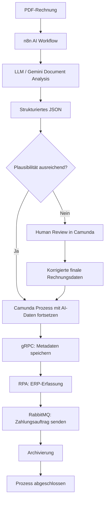
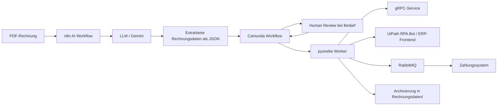

# Sprint 6 — AI Agent für Rechnungsinformationen

**Projekt:** DVG — Digitalisierung der Eingangsrechnungsbearbeitung  
**Sprint-Zeitraum:** 09.06.2026–30.06.2026  
**Team:** Sam Haghighi, Efe Yueksel, Nick Rusnak, Abubakar Abdi Tube  
**GitHub:** https://github.com/abab1016/DVG  
**Dokumentationsstand:** Phase 1 — Scope, Doku-Struktur und Demo-Ziel  
**Phase-1-Frist:** Dienstag, 16.06.2026  

---

## 1. Ziel des Sprints

Ziel von Sprint 6 ist die Erweiterung des bestehenden digitalen Eingangsrechnungsprozesses um einen AI Agent bzw. AI Workflow. Der AI Workflow soll Rechnungsinformationen aus einer PDF-Datei extrahieren, die Plausibilität der extrahierten Daten bewerten und bei unsicheren Ergebnissen eine menschliche Kontrolle ermöglichen.

Der bestehende Gesamtprozess aus den vorherigen Sprints bleibt erhalten und wird nicht ersetzt. Sprint 6 ergänzt den Prozess an der Stelle, an der bisher Rechnungsdaten manuell aus einer Rechnung übernommen werden mussten.

Der Zielablauf lautet:

```text
PDF-Rechnung
→ AI-Extraktion mit n8n / LLM
→ Plausibilitätsprüfung
→ bei Bedarf Human Review / Korrektur
→ Übergabe an Camunda-Prozess
→ Metadaten per gRPC speichern
→ ERP-Erfassung per RPA
→ Zahlungsauftrag per RabbitMQ senden
→ Rechnung archivieren
```

Damit wird der bisherige Prozess stärker automatisiert, ohne die menschliche Kontrolle vollständig zu entfernen.

---

## 2. Ausgangslage aus Sprint 1–5

### 2.1 Sprint 1 — Integrationsbausteine

In Sprint 1 wurden die technischen Grundbausteine für die spätere Rechnungsbearbeitung umgesetzt:

- gRPC-Service zur Speicherung von Rechnungsmetadaten
- RabbitMQ als Message Broker für Zahlungsaufträge
- Zahlungssystem als Consumer für Zahlungsnachrichten
- einfacher Client zur Speicherung und Zahlungsauslösung
- Dateiablage unter `Rechnungsdaten/`

Diese Komponenten bilden weiterhin die technische Basis für Sprint 6.

---

### 2.2 Sprint 2 — Process Mining und Prozessanalyse

In Sprint 2 wurde der bestehende Rechnungsprozess analysiert. Dabei wurden Prozessvarianten, manuelle Schritte und mögliche Engpässe betrachtet.

Für Sprint 6 ist daraus besonders relevant:

- Die manuelle Erfassung von Rechnungsinformationen ist ein Medienbruch.
- Die Rechnungsdaten müssen möglichst früh strukturiert vorliegen.
- Varianten und Fehlerfälle müssen im Prozess sichtbar bleiben.
- Automatisierung darf fachliche Kontrolle nicht vollständig ersetzen.

---

### 2.3 Sprint 3 — Soll-Prozess und Zielarchitektur

In Sprint 3 wurde der Soll-Prozess modelliert und die Zielarchitektur vorbereitet. Daraus wurde festgelegt, dass der Prozess über eine Workflow Engine gesteuert werden soll.

Für Sprint 6 ist relevant:

- Camunda bleibt zentrale Prozesssteuerung.
- Services werden über definierte Schnittstellen eingebunden.
- Manuelle Aufgaben werden über User Tasks/Formulare abgebildet.
- Automatisierte Schritte werden über Service Tasks/Worker angebunden.

---

### 2.4 Sprint 4 — Workflow-Implementierung mit Camunda

In Sprint 4 wurde der digitale Rechnungsfreigabeprozess als Camunda-Workflow umgesetzt.

Der Workflow enthält bereits:

- Prozessstart über E-Mail oder Portal
- manuelle Erfassung von Metadaten
- Speicherung der Metadaten per gRPC
- Rechnungsprüfung und Freigabe
- optionale Compliance-Prüfung
- ERP-Erfassung
- Zahlung per RabbitMQ
- Archivierung
- Fehlerbehandlung für technische Fehler

Sprint 6 ersetzt nicht den Camunda-Prozess, sondern erweitert ihn vor der weiteren Verarbeitung um eine AI-gestützte Vorverarbeitung der Rechnung.

---

### 2.5 Sprint 5 — RPA für ERP-Erfassung

In Sprint 5 wurde ein RPA-Bot zur Automatisierung der ERP-Erfassung umgesetzt. Der Bot übernimmt die Aufgabe, Rechnungsdaten in das ERP-Frontend einzutragen.

Für Sprint 6 ist wichtig:

- Der RPA-Bot soll weiterhin im Prozess verwendet werden.
- Die Datenquelle ändert sich: Statt rein manueller Eingabe sollen die Daten aus AI-Extraktion und ggf. Human Review stammen.
- Die final geprüften Prozessdaten müssen an den RPA-Schritt übergeben werden.

---

## 3. Scope von Sprint 6

### 3.1 In Scope

Sprint 6 umfasst folgende Punkte:

1. **AI Workflow / AI Agent mit n8n**
   - n8n wird als Tool für den AI Workflow verwendet.
   - Ein LLM, voraussichtlich Gemini, wird zur Dokumentanalyse eingebunden.
   - Der Workflow verarbeitet PDF-Rechnungen.

2. **Extraktion von Rechnungsdaten**
   - Metadaten werden aus der PDF extrahiert.
   - Rechnungspositionen werden, soweit möglich, ebenfalls extrahiert.
   - Die Ausgabe erfolgt in einem strukturierten JSON-Format.

3. **Plausibilitätsprüfung**
   - Pflichtfelder werden geprüft.
   - Eine Confidence-/Plausibilitätsentscheidung wird verwendet.
   - Unsichere Ergebnisse werden markiert.

4. **Human Review**
   - Bei niedriger Plausibilität oder fehlenden Daten wird ein manueller Prüfschritt ausgeführt.
   - Der Mensch kann die extrahierten Daten kontrollieren und korrigieren.
   - Korrigierte Daten werden anschließend als finale Prozessdaten verwendet.

5. **Anpassung des Camunda-Workflows**
   - Der bestehende Workflow wird um AI-Vorverarbeitung ergänzt.
   - Ein Gateway entscheidet, ob Human Review nötig ist.
   - Danach läuft der bestehende Prozess weiter.

6. **Integration in Gesamtprozess**
   - gRPC-Speicherung bleibt erhalten.
   - RPA/ERP-Erfassung bleibt erhalten.
   - RabbitMQ-Zahlung bleibt erhalten.
   - Archivierung bleibt erhalten.

7. **Gesamtdemonstration**
   - Der vollständige Prozess wird im Review demonstriert.
   - Es soll mindestens ein Happy Path und ein Human-Review-Fall gezeigt werden.

8. **Dokumentation**
   - Sprint-6-Gesamtdokumentation wird erstellt.
   - KI-Nutzung wird transparent dokumentiert.
   - Fehlerfälle und Grenzen werden beschrieben.

9. **Persönliche Lernzusammenfassungen**
   - Jede Person erstellt eine 2-seitige Zusammenfassung des Gelernten.

---

### 3.2 Nicht Scope

Nicht Bestandteil von Sprint 6 sind:

| Nicht Bestandteil | Grund |
| --- | --- |
| Produktive Rechnungsverarbeitung mit echten Lieferantendaten | Projekt ist ein Prototyp |
| Verarbeitung echter personenbezogener oder sensibler Rechnungen | Datenschutz und API-Risiko |
| Vollständige Buchhaltung/Bankintegration | Zahlungssystem bleibt Simulation |
| Vollständig autonomer Agent ohne menschliche Kontrolle | Kritische Rechnungsdaten benötigen Human Review |
| Vollständige OCR-/Dokumentenmanagement-Plattform | n8n/LLM reicht für den Sprint-Prototyp |
| Perfekte Extraktion aller möglichen Rechnungsformate | Demo fokussiert auf kontrollierte Beispielrechnungen |
| Ersatz von Camunda durch n8n | n8n ergänzt den Prozess nur für AI-Vorverarbeitung |
| Ersatz des RPA-Bots | Sprint-5-RPA bleibt Bestandteil des Gesamtprozesses |

---

## 4. Phase-1-Ergebnis: Scope, Doku-Struktur und Demo-Ziel

Diese Phase legt den Rahmen für die weitere Umsetzung fest.

### 4.1 Ergebnis von Phase 1

Bis Dienstag, 16.06.2026, wurde für Vorgang 1 erledigt:

- Sprint-6-Scope ist definiert.
- Zielprozess ist festgelegt.
- Doku-Struktur ist angelegt.
- Demo-Ziel ist beschrieben.
- Abhängigkeiten sind klar.
- Offene Punkte für spätere Phasen sind markiert.

---

### 4.2 Parallel laufende Vorgänge in Phase 1

| Vorgang | Phase-1-Aufgabe |
| --- | --- |
| Vorgang 4 | Datenvertrag, JSON, Mapping und Validierungslogik starten |
| Vorgang 3 | Demo-Rechnungen erstellen oder auf Vollständigkeit prüfen |
| Vorgang 2 | n8n lokal einrichten |
| Vorgang 1 | Scope, Doku-Struktur und Demo-Ziel festlegen |

---

## 5. Zielprozess für Sprint 6

Der Zielprozess erweitert den bisherigen Camunda-Prozess um eine AI-Vorverarbeitung.

### 5.1 Fachlicher Ablauf

1. Eine Rechnung liegt als PDF-Datei vor.
2. n8n verarbeitet die PDF.
3. Ein LLM extrahiert Rechnungsdaten.
4. Die extrahierten Daten werden in ein JSON-Format gebracht.
5. Die Plausibilität der Daten wird geprüft.
6. Wenn die Daten plausibel sind, werden sie direkt an den Camunda-Prozess übergeben.
7. Wenn die Daten unsicher oder unvollständig sind, wird ein Human-Review-Schritt ausgeführt.
8. Ein Sachbearbeiter prüft und korrigiert die Daten.
9. Die finalen Daten werden im weiteren Prozess verwendet.
10. Die Metadaten werden per gRPC gespeichert.
11. Die Rechnung wird im ERP-Frontend per RPA erfasst.
12. Der Zahlungsauftrag wird per RabbitMQ gesendet.
13. Die Rechnung wird archiviert.

---

### 5.2 Technischer Zielablauf



---

## 6. Geplante Architektur für Sprint 6

Sprint 6 ergänzt die bestehende Architektur um n8n und ein LLM.

### 6.1 Bestehende Komponenten

| Komponente | Rolle |
| --- | --- |
| Camunda 8 | Zentrale Prozesssteuerung |
| pyzeebe Worker | Führt Service Tasks aus |
| gRPC-Service | Speichert Rechnungsmetadaten |
| RabbitMQ | Message Broker für Zahlungsaufträge |
| Zahlungssystem | Verarbeitet Zahlungsaufträge |
| UiPath RPA Bot | Erfasst Rechnungsdaten im ERP-Frontend |
| `Rechnungsdaten/` | Dateiablage für Rechnungsdaten, Zahlungslog und Abschlussdaten |

---

### 6.2 Neue Sprint-6-Komponenten

| Komponente | Rolle |
| --- | --- |
| n8n | Umsetzung des AI Workflows |
| Gemini / LLM | Analyse der PDF-Rechnung |
| AI Extraction JSON | Strukturierte Ausgabe der extrahierten Rechnungsdaten |
| Plausibilitätslogik | Bewertung, ob Human Review nötig ist |
| Human Review Form | Manuelle Kontrolle/Korrektur unsicherer AI-Ergebnisse |

---

### 6.3 Logische Architektur



---

## 7. Doku-Struktur für Sprint 6

Die Sprint-6-Dokumentation soll folgende Struktur erhalten:

```text
docs/sprint6_ai-agent.md
```

Geplante Kapitel:

```md
# Sprint 6 — AI Agent für Rechnungsinformationen

## 1. Ziel des Sprints
## 2. Ausgangslage aus Sprint 1–5
## 3. Scope von Sprint 6
## 4. Phase-1-Ergebnis: Scope, Doku-Struktur und Demo-Ziel
## 5. Zielprozess für Sprint 6
## 6. Geplante Architektur für Sprint 6
## 7. Doku-Struktur für Sprint 6
## 8. Datenvertrag und JSON-Struktur
## 9. n8n AI Workflow
## 10. Plausibilitätsprüfung und Human Review
## 11. Camunda-Anpassungen
## 12. Integration mit gRPC, RPA, RabbitMQ und Archivierung
## 13. Demo-Szenarien
## 14. Fehlerfälle und Grenzen
## 15. KI-Nutzung und Datenschutz
## 16. Tests und Qualitätssicherung
## 17. Ergebnis und Fazit
```

---

## 8. Demo-Ziel für Sprint 6

Ziel der Demo ist es, zu zeigen, dass die Gesamtanwendung durch einen AI Workflow erweitert wurde und weiterhin Ende-zu-Ende funktioniert.

Die Demo soll nicht nur einzelne Komponenten zeigen, sondern den vollständigen Prozess von der PDF-Rechnung bis zur Archivierung nachvollziehbar machen.

---

### 8.1 Demo-Szenario 1 — Happy Path

Im Happy Path wird eine vollständige, gut lesbare PDF-Rechnung verarbeitet.

Ablauf:

1. Demo-PDF wird in n8n verarbeitet.
2. LLM extrahiert Rechnungsdaten.
3. JSON-Ausgabe enthält alle Pflichtfelder.
4. Plausibilitätsprüfung ergibt `VALID`.
5. Camunda-Prozess läuft ohne Human Review weiter.
6. Metadaten werden per gRPC gespeichert.
7. RPA-Bot erfasst Daten im ERP-Frontend.
8. Zahlungsauftrag wird über RabbitMQ gesendet.
9. Rechnung wird archiviert.
10. Prozess endet erfolgreich.

Erwartetes Demo-Ergebnis:

- n8n zeigt erfolgreiche Extraktion.
- Camunda/Operate zeigt erfolgreichen Prozessdurchlauf.
- `Rechnungsdaten/<invoiceId>.json` wurde erstellt.
- `Rechnungsdaten/zahlungslog.json` enthält Zahlungsstatus.
- `Rechnungsdaten/<invoiceId>_abschluss.json` wurde erstellt.
- ERP-Erfassung ist sichtbar oder per Screenshot belegbar.

---

### 8.2 Demo-Szenario 2 — Human Review

Im Human-Review-Fall wird eine PDF-Rechnung mit unvollständigen oder unsicheren Daten verarbeitet.

Ablauf:

1. Demo-PDF wird in n8n verarbeitet.
2. LLM extrahiert Rechnungsdaten, aber mindestens ein Feld ist unsicher oder fehlt.
3. Plausibilitätsprüfung ergibt `NEEDS_REVIEW`.
4. Camunda leitet in einen Human-Review-Task.
5. Sachbearbeiter prüft und korrigiert die Daten.
6. Korrigierte Daten werden als finale Prozessdaten verwendet.
7. Prozess läuft danach weiter wie im Happy Path.

Erwartetes Demo-Ergebnis:

- Human Review wird sichtbar ausgelöst.
- Korrekturformular zeigt AI-Daten und Validierungsfehler.
- Nach Korrektur läuft der Prozess weiter.
- Die korrigierten Daten werden nicht nur angezeigt, sondern tatsächlich weiterverwendet.

---

### 8.3 Optionales Demo-Szenario — Fehlerfall

Optional kann ein technischer oder fachlicher Fehler gezeigt werden.

Mögliche Fehlerfälle:

- PDF nicht lesbar
- Pflichtfeld fehlt
- LLM/API nicht erreichbar
- gRPC-Service nicht erreichbar
- RabbitMQ nicht erreichbar

Ziel ist nicht, alle Fehlerfälle live zu zeigen. Mindestens ein Fehlerfall soll dokumentiert und bei Bedarf demonstrierbar sein.

---

## 9. Abhängigkeiten für Phase 1 und nächste Schritte

### 9.1 Abhängigkeiten

| Thema | Bedeutung |
| --- | --- |
| Datenvertrag / JSON | Wird für finale Doku, Mapping und Demo benötigt |
| Demo-PDFs | Werden für n8n-Test und Demo benötigt |
| n8n Setup | Wird für AI Workflow und technische Doku benötigt |
| Camunda-Anpassung | Wird für End-to-End-Test benötigt |
| Human Review Formular | Wird für Human-Review-Demo benötigt |
| RPA/ERP-Test | Wird für Gesamt-Demo benötigt |

---

### 9.2 Was in Phase 1 erledigt wurde

In Phase 1 ohne weitere Implementierungsergebnisse erledigt:

- Sprint-6-Scope dokumentiert
- Zielprozess beschrieben
- Doku-Datei angelegt
- Doku-Struktur vorbereitet
- Demo-Ziel definiert
- Demo-Szenarien beschrieben
- KI-Nutzung und Datenschutz als geplanten Abschnitt vorbereitet
- offene Abhängigkeiten markiert

---

## 10. Phase-1-Checkliste für Vorgang 1

| Aufgabe | Status |
| --- | --- |
| Sprint-6-Scope definiert | erledigt |
| Zielprozess beschrieben | erledigt |
| Doku-Struktur erstellt | erledigt |
| Demo-Ziel festgelegt | erledigt |
| Demo-Szenario Happy Path beschrieben | erledigt |
| Demo-Szenario Human Review beschrieben | erledigt |
| Abhängigkeiten dokumentiert | erledigt |
| Offene Punkte für spätere Phasen markiert | erledigt |

---